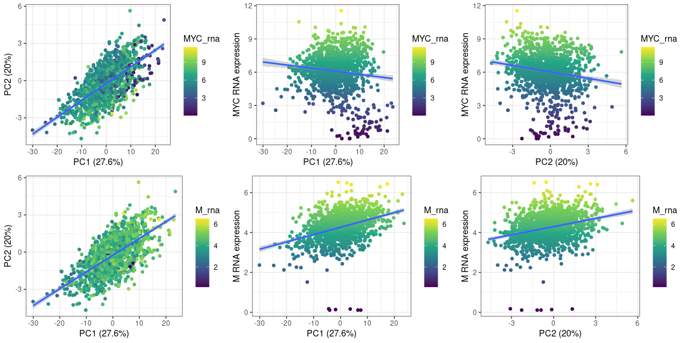
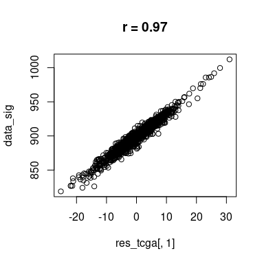

Two methods to generate a expression signature

1.  GSVA. Assuming high expression

2.  PCA space based on experimental data (gene M perturbation)

3.  GSVA method

Consider M regulated ZNFs as a gene set, run GSVA on TCGA samples.

    ## TCGA_res

    gsc = getBroadSets("/storage/westbrook/public_datasets/msigdb/msigdb_v7.4.xml")
    types = sapply(gsc, function(elt) bcCategory(collectionType(elt)))
    c2gsc = gsc[types == "c2"]

    symbols = sapply(rownames(tcga), function(id) {
        ensembl_id = strsplit(id, "[.]")[[1]][1]
        mart$Gene.name[match(ensembl_id, mart[, 1])]
    })

    ind = !(is.na(symbols) | duplicated(symbols))
    tcga_s = tcga[ind, ]
    rownames(tcga_s) = symbols[ind]

    expset = ExpressionSet(as.matrix(tcga_s))

    goiznf = subset(goi, KRAB.ZNF == T)
    data_sig = colSums(tcga_s[intersect(goiznf$symbol, rownames(tcga_s)),
        ])

    goiznf_res = gsva(expset, GeneSetCollection(GeneSet(goiznf$symbol,
        setName = "goiZNF")), method = "gsva")

    ## Warning in .filterFeatures(expr, method): 681 genes with constant expression
    ## values throuhgout the samples.

    ## Warning in .filterFeatures(expr, method): Since argument method!="ssgsea", genes
    ## with constant expression values are discarded.

    ## No annotation package name available in the input 'ExpressionSet' object 'expr'.
    ## Attempting to directly match identifiers in 'expr' to gene sets.
    ## Estimating GSVA scores for 1 gene sets.
    ## Estimating ECDFs with Gaussian kernels
    ##   |                                                                              |                                                                      |   0%  |                                                                              |======================================================================| 100%

    goiznf_output = as.numeric(exprs(goiznf_res))
    names(goiznf_output) = colnames(exprs(goiznf_res))

Quality control for GSVA results on ZNF. If the method is valid, it
should:

1.  similar to the sum of scaled gene expression
2.  be able to separate M Wild-type and knock-down samples.

<!-- -->

    ## QC1: association between sum expression and gsva score

    goiznf = subset(goi, KRAB.ZNF == T)
    data_sig = colSums(tcga_s[intersect(goiznf$symbol, rownames(tcga_s)),
        ])

    goiznf_res = gsva(expset, GeneSetCollection(GeneSet(goiznf$symbol,
        setName = "goiZNF")), method = "gsva")

    ## Warning in .filterFeatures(expr, method): 681 genes with constant expression
    ## values throuhgout the samples.

    ## Warning in .filterFeatures(expr, method): Since argument method!="ssgsea", genes
    ## with constant expression values are discarded.

    ## No annotation package name available in the input 'ExpressionSet' object 'expr'.
    ## Attempting to directly match identifiers in 'expr' to gene sets.
    ## Estimating GSVA scores for 1 gene sets.
    ## Estimating ECDFs with Gaussian kernels
    ##   |                                                                              |                                                                      |   0%  |                                                                              |======================================================================| 100%

    goiznf_output = as.numeric(exprs(goiznf_res))
    names(goiznf_output) = colnames(exprs(goiznf_res))
    plot(goiznf_output, data_sig)

    ## QC2: see if M perturbation causes changes in gsva score

    rn = intersect(intersect(names(symbols), rownames(tables$ltpm)),
        rownames(rna_tables$ltpm))

    qcexpset = tcga_s[mart[match(rn, mart[, 1]), "Gene.name"], names(sort(goiznf_output)[seq(120,
        1100, 120)])]
    qcexpset = cbind(qcexpset, log2(tables$fpkm_uq[rn, ] + 1), log2(rna_tables$fpkm_uq[rn,
        ] + 1))

    qc_res = gsva(scale(as.matrix(qcexpset)), GeneSetCollection(GeneSet(goiznf$symbol,
        setName = "goiZNF")), method = "gsva")

    ## Warning in .filterFeatures(expr, method): 2073 genes with constant expression
    ## values throuhgout the samples.

    ## Warning in .filterFeatures(expr, method): Since argument method!="ssgsea", genes
    ## with constant expression values are discarded.

    ## Estimating GSVA scores for 1 gene sets.
    ## Estimating ECDFs with Gaussian kernels
    ##   |                                                                              |                                                                      |   0%  |                                                                              |======================================================================| 100%

    qc_res_1 = gsva(scale(as.matrix(qcexpset)), GeneSetCollection(GeneSet(unique(znf),
        setName = "ZNF")), method = "gsva")

    ## Warning in .filterFeatures(expr, method): 2073 genes with constant expression
    ## values throuhgout the samples.

    ## Warning in .filterFeatures(expr, method): Since argument method!="ssgsea", genes
    ## with constant expression values are discarded.

    ## Estimating GSVA scores for 1 gene sets.
    ## Estimating ECDFs with Gaussian kernels
    ##   |                                                                              |                                                                      |   0%  |                                                                              |======================================================================| 100%

    pdata = data.frame(row.names = colnames(qc_res), goiznf_res = t(qc_res),
        allznf_res = t(qc_res_1), cell_line = c(rep("TCGA", 9), sample_sheet$cell_line,
            rep("A9", 48)), MYC = c(rep("TCGA", 9), sample_sheet$cell_line,
            sample_sheet_all$treatment1[25:72]), M = c(rep("TCGA",
            9), sample_sheet$cell_line, sample_sheet_all$treatment2[25:72]))

    ggplot(pdata[1:65, ], aes(goiZNF, ZNF, color = cell_line)) +
        geom_point() + theme_bw()

    ggplot(pdata[102:113, ], aes(goiZNF, ZNF, color = MYC, shape = M)) +
        geom_point() + theme_bw()

1.  PCA space based on experimental data (gene M perturbation)

<!-- -->

    all_gene_id = intersect(intersect(rownames(tcga), rownames(hg8)),
        mart[match(colnames(ccle_rnaseq), mart$Gene.name), "Gene.stable.ID"])

    znf_id = intersect(mart[match(znf, mart$Gene.name), "Gene.stable.ID"],
        all_gene_id)
    znf_symbol = mart[match(znf_id, mart$Gene.stable.ID), "Gene.name"]

    training = scale(t(hg8[znf_id, ]))
    tcga_znf = scale(t(tcga[znf_id, ]))
    ccle_znf = scale(as.matrix(ccle_rnaseq[, znf_symbol]))
    colnames(ccle_znf) = znf_id

    pc = prcomp(training[37:48, ])
    imp_pc1 = summary(pc)$importance["Proportion of Variance", 1] *
        100
    imp_pc2 = summary(pc)$importance["Proportion of Variance", 2] *
        100

    df = as.data.frame(pc$x)
    group = factor(c(rep("EtOH_DMSO", 3), rep("EtOH_dTAG", 3), rep("Tam_DMSO",
        3), rep("Tam_dTAG", 3)))
    df = cbind(df, group)

    ggplot(df, aes(x = PC1, y = PC2, color = group)) + geom_point() +
        theme_bw() + xlab(paste("PC1 (", round(imp_pc1, 1), "%)",
        sep = "")) + ylab(paste("PC2 (", round(imp_pc2, 1), "%)",
        sep = ""))

Projecting TCGA and CCLE samples into the PCA space.

    ## predict on TCGA
    res_tcga = data.frame(predict(pc, tcga_znf), group = "TCGA")
    ggplot(rbind(df, res_tcga), aes(x = PC1, y = PC2, color = group)) +
        geom_point() + theme_bw() + xlab(paste("PC1 (", round(imp_pc1,
        1), "%)", sep = "")) + ylab(paste("PC2 (", round(imp_pc2,
        1), "%)", sep = ""))

    ## predict on CCLE

    res_ccle = data.frame(predict(pc, ccle_znf), group = "CCLE")
    ggplot(rbind(df, res_ccle), aes(x = PC1, y = PC2, color = group)) +
        geom_point() + theme_bw() + xlab(paste("PC1 (", round(imp_pc1,
        1), "%)", sep = "")) + ylab(paste("PC2 (", round(imp_pc2,
        1), "%)", sep = ""))

Quality control for PCA projection. The tumors with high MYC expression
should have low PC2 (resemble tamoxifen treated experimental samples);
while tumors with high M expression should have low PC1 (resemble WT
samples).

    res_tcga$MYC_rna = t(tcga)[, mart[match("MYC", mart$Gene.name),
        "Gene.stable.ID"]]
    res_tcga$M_rna = t(tcga)[, "ENSG00000196199"]

    res_ccle$MYC_rna = ccle_rnaseq[, "MYC"]
    res_ccle$M_rna = ccle_rnaseq[, mart[match("ENSG00000196199",
        mart$Gene.stable.ID), "Gene.name"]]
    res_ccle$MYC_dep = drive_rsa$MYC[match(rownames(res_ccle), drive_rsa$DepMap_ID)]

    colorPCA = function(data) {
        p1 = ggplot(data, aes(x = PC1, y = PC2, color = MYC_rna)) +
            geom_point() + theme_bw() + scale_color_viridis_c() +
            geom_smooth(method = "lm") + xlab(paste("PC1 (", round(imp_pc1,
            1), "%)", sep = "")) + ylab(paste("PC2 (", round(imp_pc2,
            1), "%)", sep = ""))
        p2 = ggplot(data, aes(x = PC1, y = MYC_rna, color = MYC_rna)) +
            geom_point() + theme_bw() + scale_color_viridis_c() +
            geom_smooth(method = "lm") + xlab(paste("PC1 (", round(imp_pc1,
            1), "%)", sep = "")) + ylab("MYC RNA expression")
        p3 = ggplot(data, aes(x = PC2, y = MYC_rna, color = MYC_rna)) +
            geom_point() + theme_bw() + scale_color_viridis_c() +
            geom_smooth(method = "lm") + xlab(paste("PC2 (", round(imp_pc2,
            1), "%)", sep = "")) + ylab("MYC RNA expression")
        p4 = ggplot(data, aes(x = PC1, y = PC2, color = M_rna)) +
            geom_point() + theme_bw() + scale_color_viridis_c() +
            geom_smooth(method = "lm") + xlab(paste("PC1 (", round(imp_pc1,
            1), "%)", sep = "")) + ylab(paste("PC2 (", round(imp_pc2,
            1), "%)", sep = ""))
        p5 = ggplot(data, aes(x = PC1, y = M_rna, color = M_rna)) +
            geom_point() + theme_bw() + scale_color_viridis_c() +
            geom_smooth(method = "lm") + xlab(paste("PC1 (", round(imp_pc1,
            1), "%)", sep = "")) + ylab("M RNA expression")
        p6 = ggplot(data, aes(x = PC2, y = M_rna, color = M_rna)) +
            geom_point() + theme_bw() + scale_color_viridis_c() +
            geom_smooth(method = "lm") + xlab(paste("PC2 (", round(imp_pc2,
            1), "%)", sep = "")) + ylab("M RNA expression")

        p = grid.arrange(p1, p2, p3, p4, p5, p6, ncol = 3)
    }

    colorPCA(res_tcga)

    ## `geom_smooth()` using formula 'y ~ x'
    ## `geom_smooth()` using formula 'y ~ x'
    ## `geom_smooth()` using formula 'y ~ x'
    ## `geom_smooth()` using formula 'y ~ x'
    ## `geom_smooth()` using formula 'y ~ x'
    ## `geom_smooth()` using formula 'y ~ x'

    colorPCA(res_ccle)

    ## `geom_smooth()` using formula 'y ~ x'
    ## `geom_smooth()` using formula 'y ~ x'
    ## `geom_smooth()` using formula 'y ~ x'
    ## `geom_smooth()` using formula 'y ~ x'
    ## `geom_smooth()` using formula 'y ~ x'
    ## `geom_smooth()` using formula 'y ~ x'

Comparing two methods of signature and sum of expression. The spearman
correlations are high.

    plot(res_tcga[, 1], goiznf_output, main = paste("r =", round(cor(res_tcga[,
        1], goiznf_output, method = "spearman"), digit = 2)))

    plot(res_tcga[, 1], data_sig, main = paste("r =", round(cor(res_tcga[,
        1], data_sig, method = "spearman"), digit = 2)))

    plot(goiznf_output, data_sig, main = paste("r =", round(cor(goiznf_output,
        data_sig, method = "spearman"), digit = 2)))

The following analysis uses the signature generated by PCA methods.

Explore the top correlated pathway and anti-correlated pathways to the
ZNF signature

    gsva_cor = function(test_signature, gsva_output, subset = NULL,
        n = 10) {

        gsva_sigcor = apply(gsva_output, 1, function(x) {
            cor(x, test_signature, use = "na.or.complete", method = "spearman")
        })

        pdata = sort(gsva_sigcor, decreasing = T)
        pdata = pdata[grep(paste(subset, "_", sep = ""), names(pdata))]
        pdata = as.data.frame(c(head(pdata, n), tail(pdata, n)))
        colnames(pdata) = "Correlation"
        pdata = transform(pdata, gene_set = rownames(pdata), color = c(rep("pos",
            n), rep("neg", n)))

        ggplot(pdata, aes(reorder(gene_set, Correlation), Correlation,
            fill = color)) + geom_bar(stat = "identity") + scale_fill_manual(values = c(mypal[["bcmblue"]],
            mypal[["ered"]])) + coord_flip() + xlab("") + theme_bw()

    }

    gsva_cor(res_tcga[, 1], gsva_tcga, "REACTOME", n = 10)

Visualizing single correlations. Highlight the overlaps in genesets to
see if the correlation is an artifact of overlapping genesets.

    plot_pw_sig_cor = function(signature, pathway) {

        geneset = geneIds(c2gsc[[pathway]])
        cor_sig = sapply(geneset, function(gene) {
            cor(as.numeric(tcga_s[gene, ]), signature, method = "spearman")
        })
        cor_pw = sapply(geneset, function(gene) {
            cor(as.numeric(tcga_s[gene, ]), as.numeric(gsva_tcga[pathway,
                ]), method = "spearman")
        })

        pdata = data.frame(cor_sig = cor_sig, cor_pw = cor_pw, row.names = geneset,
            overlap = geneset %in% goiznf$symbol)

        ggplot(pdata, aes(cor_sig, cor_pw, color = overlap)) + geom_point() +
            geom_hline(yintercept = 0, linetype = "dashed") + geom_vline(xintercept = 0,
            linetype = "dashed") + labs(x = "Correlation with ZNF signature",
            y = paste("Correlation with", pathway)) + scale_color_manual(values = c("grey",
            mypal[["ered"]])) + theme_bw()

    }

    plot_pw_sig_cor(res_tcga[, 1], "HAMAI_APOPTOSIS_VIA_TRAIL_UP")

    ## Warning in cor(as.numeric(tcga_s[gene, ]), signature, method = "spearman"): the
    ## standard deviation is zero

    ## Warning in cor(as.numeric(tcga_s[gene, ]), as.numeric(gsva_tcga[pathway, : the
    ## standard deviation is zero

    ## Warning: Removed 2 rows containing missing values (geom_point).

What gene expression is mostly correlated with the ZNF signature?

    cor_znf_all = apply(tcga_s, 1, function(gene) {
        cor(gene, res_tcga[, 1], method = "spearman")
    })

    ## Warning in cor(gene, res_tcga[, 1], method = "spearman"): the standard deviation
    ## is zero

    ## Warning in cor(gene, res_tcga[, 1], method = "spearman"): the standard deviation
    ## is zero

    ## Warning in cor(gene, res_tcga[, 1], method = "spearman"): the standard deviation
    ## is zero

    ## Warning in cor(gene, res_tcga[, 1], method = "spearman"): the standard deviation
    ## is zero

    ## Warning in cor(gene, res_tcga[, 1], method = "spearman"): the standard deviation
    ## is zero

    ## Warning in cor(gene, res_tcga[, 1], method = "spearman"): the standard deviation
    ## is zero

    ## Warning in cor(gene, res_tcga[, 1], method = "spearman"): the standard deviation
    ## is zero

    ## Warning in cor(gene, res_tcga[, 1], method = "spearman"): the standard deviation
    ## is zero

    ## Warning in cor(gene, res_tcga[, 1], method = "spearman"): the standard deviation
    ## is zero

    ## Warning in cor(gene, res_tcga[, 1], method = "spearman"): the standard deviation
    ## is zero

    ## Warning in cor(gene, res_tcga[, 1], method = "spearman"): the standard deviation
    ## is zero

    ## Warning in cor(gene, res_tcga[, 1], method = "spearman"): the standard deviation
    ## is zero

    ## Warning in cor(gene, res_tcga[, 1], method = "spearman"): the standard deviation
    ## is zero

    ## Warning in cor(gene, res_tcga[, 1], method = "spearman"): the standard deviation
    ## is zero

    ## Warning in cor(gene, res_tcga[, 1], method = "spearman"): the standard deviation
    ## is zero

    ## Warning in cor(gene, res_tcga[, 1], method = "spearman"): the standard deviation
    ## is zero

    ## Warning in cor(gene, res_tcga[, 1], method = "spearman"): the standard deviation
    ## is zero

    ## Warning in cor(gene, res_tcga[, 1], method = "spearman"): the standard deviation
    ## is zero

    ## Warning in cor(gene, res_tcga[, 1], method = "spearman"): the standard deviation
    ## is zero

    ## Warning in cor(gene, res_tcga[, 1], method = "spearman"): the standard deviation
    ## is zero

    ## Warning in cor(gene, res_tcga[, 1], method = "spearman"): the standard deviation
    ## is zero

    ## Warning in cor(gene, res_tcga[, 1], method = "spearman"): the standard deviation
    ## is zero

    ## Warning in cor(gene, res_tcga[, 1], method = "spearman"): the standard deviation
    ## is zero

    ## Warning in cor(gene, res_tcga[, 1], method = "spearman"): the standard deviation
    ## is zero

    ## Warning in cor(gene, res_tcga[, 1], method = "spearman"): the standard deviation
    ## is zero

    ## Warning in cor(gene, res_tcga[, 1], method = "spearman"): the standard deviation
    ## is zero

    ## Warning in cor(gene, res_tcga[, 1], method = "spearman"): the standard deviation
    ## is zero

    ## Warning in cor(gene, res_tcga[, 1], method = "spearman"): the standard deviation
    ## is zero

    ## Warning in cor(gene, res_tcga[, 1], method = "spearman"): the standard deviation
    ## is zero

    ## Warning in cor(gene, res_tcga[, 1], method = "spearman"): the standard deviation
    ## is zero

    ## Warning in cor(gene, res_tcga[, 1], method = "spearman"): the standard deviation
    ## is zero

    ## Warning in cor(gene, res_tcga[, 1], method = "spearman"): the standard deviation
    ## is zero

    ## Warning in cor(gene, res_tcga[, 1], method = "spearman"): the standard deviation
    ## is zero

    ## Warning in cor(gene, res_tcga[, 1], method = "spearman"): the standard deviation
    ## is zero

    ## Warning in cor(gene, res_tcga[, 1], method = "spearman"): the standard deviation
    ## is zero

    ## Warning in cor(gene, res_tcga[, 1], method = "spearman"): the standard deviation
    ## is zero

    ## Warning in cor(gene, res_tcga[, 1], method = "spearman"): the standard deviation
    ## is zero

    ## Warning in cor(gene, res_tcga[, 1], method = "spearman"): the standard deviation
    ## is zero

    ## Warning in cor(gene, res_tcga[, 1], method = "spearman"): the standard deviation
    ## is zero

    ## Warning in cor(gene, res_tcga[, 1], method = "spearman"): the standard deviation
    ## is zero

    ## Warning in cor(gene, res_tcga[, 1], method = "spearman"): the standard deviation
    ## is zero

    ## Warning in cor(gene, res_tcga[, 1], method = "spearman"): the standard deviation
    ## is zero

    ## Warning in cor(gene, res_tcga[, 1], method = "spearman"): the standard deviation
    ## is zero

    ## Warning in cor(gene, res_tcga[, 1], method = "spearman"): the standard deviation
    ## is zero

    ## Warning in cor(gene, res_tcga[, 1], method = "spearman"): the standard deviation
    ## is zero

    ## Warning in cor(gene, res_tcga[, 1], method = "spearman"): the standard deviation
    ## is zero

    ## Warning in cor(gene, res_tcga[, 1], method = "spearman"): the standard deviation
    ## is zero

    ## Warning in cor(gene, res_tcga[, 1], method = "spearman"): the standard deviation
    ## is zero

    ## Warning in cor(gene, res_tcga[, 1], method = "spearman"): the standard deviation
    ## is zero

    ## Warning in cor(gene, res_tcga[, 1], method = "spearman"): the standard deviation
    ## is zero

    ## Warning in cor(gene, res_tcga[, 1], method = "spearman"): the standard deviation
    ## is zero

    ## Warning in cor(gene, res_tcga[, 1], method = "spearman"): the standard deviation
    ## is zero

    ## Warning in cor(gene, res_tcga[, 1], method = "spearman"): the standard deviation
    ## is zero

    ## Warning in cor(gene, res_tcga[, 1], method = "spearman"): the standard deviation
    ## is zero

    ## Warning in cor(gene, res_tcga[, 1], method = "spearman"): the standard deviation
    ## is zero

    ## Warning in cor(gene, res_tcga[, 1], method = "spearman"): the standard deviation
    ## is zero

    ## Warning in cor(gene, res_tcga[, 1], method = "spearman"): the standard deviation
    ## is zero

    ## Warning in cor(gene, res_tcga[, 1], method = "spearman"): the standard deviation
    ## is zero

    ## Warning in cor(gene, res_tcga[, 1], method = "spearman"): the standard deviation
    ## is zero

    ## Warning in cor(gene, res_tcga[, 1], method = "spearman"): the standard deviation
    ## is zero

    ## Warning in cor(gene, res_tcga[, 1], method = "spearman"): the standard deviation
    ## is zero

    ## Warning in cor(gene, res_tcga[, 1], method = "spearman"): the standard deviation
    ## is zero

    ## Warning in cor(gene, res_tcga[, 1], method = "spearman"): the standard deviation
    ## is zero

    ## Warning in cor(gene, res_tcga[, 1], method = "spearman"): the standard deviation
    ## is zero

    ## Warning in cor(gene, res_tcga[, 1], method = "spearman"): the standard deviation
    ## is zero

    ## Warning in cor(gene, res_tcga[, 1], method = "spearman"): the standard deviation
    ## is zero

    ## Warning in cor(gene, res_tcga[, 1], method = "spearman"): the standard deviation
    ## is zero

    ## Warning in cor(gene, res_tcga[, 1], method = "spearman"): the standard deviation
    ## is zero

    ## Warning in cor(gene, res_tcga[, 1], method = "spearman"): the standard deviation
    ## is zero

    ## Warning in cor(gene, res_tcga[, 1], method = "spearman"): the standard deviation
    ## is zero

    ## Warning in cor(gene, res_tcga[, 1], method = "spearman"): the standard deviation
    ## is zero

    ## Warning in cor(gene, res_tcga[, 1], method = "spearman"): the standard deviation
    ## is zero

    ## Warning in cor(gene, res_tcga[, 1], method = "spearman"): the standard deviation
    ## is zero

    ## Warning in cor(gene, res_tcga[, 1], method = "spearman"): the standard deviation
    ## is zero

    ## Warning in cor(gene, res_tcga[, 1], method = "spearman"): the standard deviation
    ## is zero

    ## Warning in cor(gene, res_tcga[, 1], method = "spearman"): the standard deviation
    ## is zero

    ## Warning in cor(gene, res_tcga[, 1], method = "spearman"): the standard deviation
    ## is zero

    ## Warning in cor(gene, res_tcga[, 1], method = "spearman"): the standard deviation
    ## is zero

    ## Warning in cor(gene, res_tcga[, 1], method = "spearman"): the standard deviation
    ## is zero

    ## Warning in cor(gene, res_tcga[, 1], method = "spearman"): the standard deviation
    ## is zero

    ## Warning in cor(gene, res_tcga[, 1], method = "spearman"): the standard deviation
    ## is zero

    ## Warning in cor(gene, res_tcga[, 1], method = "spearman"): the standard deviation
    ## is zero

    ## Warning in cor(gene, res_tcga[, 1], method = "spearman"): the standard deviation
    ## is zero

    ## Warning in cor(gene, res_tcga[, 1], method = "spearman"): the standard deviation
    ## is zero

    ## Warning in cor(gene, res_tcga[, 1], method = "spearman"): the standard deviation
    ## is zero

    ## Warning in cor(gene, res_tcga[, 1], method = "spearman"): the standard deviation
    ## is zero

    ## Warning in cor(gene, res_tcga[, 1], method = "spearman"): the standard deviation
    ## is zero

    ## Warning in cor(gene, res_tcga[, 1], method = "spearman"): the standard deviation
    ## is zero

    ## Warning in cor(gene, res_tcga[, 1], method = "spearman"): the standard deviation
    ## is zero

    ## Warning in cor(gene, res_tcga[, 1], method = "spearman"): the standard deviation
    ## is zero

    ## Warning in cor(gene, res_tcga[, 1], method = "spearman"): the standard deviation
    ## is zero

    ## Warning in cor(gene, res_tcga[, 1], method = "spearman"): the standard deviation
    ## is zero

    ## Warning in cor(gene, res_tcga[, 1], method = "spearman"): the standard deviation
    ## is zero

    ## Warning in cor(gene, res_tcga[, 1], method = "spearman"): the standard deviation
    ## is zero

    ## Warning in cor(gene, res_tcga[, 1], method = "spearman"): the standard deviation
    ## is zero

    ## Warning in cor(gene, res_tcga[, 1], method = "spearman"): the standard deviation
    ## is zero

    ## Warning in cor(gene, res_tcga[, 1], method = "spearman"): the standard deviation
    ## is zero

    ## Warning in cor(gene, res_tcga[, 1], method = "spearman"): the standard deviation
    ## is zero

    ## Warning in cor(gene, res_tcga[, 1], method = "spearman"): the standard deviation
    ## is zero

    ## Warning in cor(gene, res_tcga[, 1], method = "spearman"): the standard deviation
    ## is zero

    ## Warning in cor(gene, res_tcga[, 1], method = "spearman"): the standard deviation
    ## is zero

    ## Warning in cor(gene, res_tcga[, 1], method = "spearman"): the standard deviation
    ## is zero

    ## Warning in cor(gene, res_tcga[, 1], method = "spearman"): the standard deviation
    ## is zero

    ## Warning in cor(gene, res_tcga[, 1], method = "spearman"): the standard deviation
    ## is zero

    ## Warning in cor(gene, res_tcga[, 1], method = "spearman"): the standard deviation
    ## is zero

    ## Warning in cor(gene, res_tcga[, 1], method = "spearman"): the standard deviation
    ## is zero

    ## Warning in cor(gene, res_tcga[, 1], method = "spearman"): the standard deviation
    ## is zero

    ## Warning in cor(gene, res_tcga[, 1], method = "spearman"): the standard deviation
    ## is zero

    ## Warning in cor(gene, res_tcga[, 1], method = "spearman"): the standard deviation
    ## is zero

    ## Warning in cor(gene, res_tcga[, 1], method = "spearman"): the standard deviation
    ## is zero

    ## Warning in cor(gene, res_tcga[, 1], method = "spearman"): the standard deviation
    ## is zero

    ## Warning in cor(gene, res_tcga[, 1], method = "spearman"): the standard deviation
    ## is zero

    ## Warning in cor(gene, res_tcga[, 1], method = "spearman"): the standard deviation
    ## is zero

    ## Warning in cor(gene, res_tcga[, 1], method = "spearman"): the standard deviation
    ## is zero

    ## Warning in cor(gene, res_tcga[, 1], method = "spearman"): the standard deviation
    ## is zero

    ## Warning in cor(gene, res_tcga[, 1], method = "spearman"): the standard deviation
    ## is zero

    ## Warning in cor(gene, res_tcga[, 1], method = "spearman"): the standard deviation
    ## is zero

    ## Warning in cor(gene, res_tcga[, 1], method = "spearman"): the standard deviation
    ## is zero

    ## Warning in cor(gene, res_tcga[, 1], method = "spearman"): the standard deviation
    ## is zero

    ## Warning in cor(gene, res_tcga[, 1], method = "spearman"): the standard deviation
    ## is zero

    ## Warning in cor(gene, res_tcga[, 1], method = "spearman"): the standard deviation
    ## is zero

    ## Warning in cor(gene, res_tcga[, 1], method = "spearman"): the standard deviation
    ## is zero

    ## Warning in cor(gene, res_tcga[, 1], method = "spearman"): the standard deviation
    ## is zero

    ## Warning in cor(gene, res_tcga[, 1], method = "spearman"): the standard deviation
    ## is zero

    ## Warning in cor(gene, res_tcga[, 1], method = "spearman"): the standard deviation
    ## is zero

    ## Warning in cor(gene, res_tcga[, 1], method = "spearman"): the standard deviation
    ## is zero

    ## Warning in cor(gene, res_tcga[, 1], method = "spearman"): the standard deviation
    ## is zero

    ## Warning in cor(gene, res_tcga[, 1], method = "spearman"): the standard deviation
    ## is zero

    ## Warning in cor(gene, res_tcga[, 1], method = "spearman"): the standard deviation
    ## is zero

    ## Warning in cor(gene, res_tcga[, 1], method = "spearman"): the standard deviation
    ## is zero

    ## Warning in cor(gene, res_tcga[, 1], method = "spearman"): the standard deviation
    ## is zero

    ## Warning in cor(gene, res_tcga[, 1], method = "spearman"): the standard deviation
    ## is zero

    ## Warning in cor(gene, res_tcga[, 1], method = "spearman"): the standard deviation
    ## is zero

    ## Warning in cor(gene, res_tcga[, 1], method = "spearman"): the standard deviation
    ## is zero

    ## Warning in cor(gene, res_tcga[, 1], method = "spearman"): the standard deviation
    ## is zero

    ## Warning in cor(gene, res_tcga[, 1], method = "spearman"): the standard deviation
    ## is zero

    ## Warning in cor(gene, res_tcga[, 1], method = "spearman"): the standard deviation
    ## is zero

    ## Warning in cor(gene, res_tcga[, 1], method = "spearman"): the standard deviation
    ## is zero

    ## Warning in cor(gene, res_tcga[, 1], method = "spearman"): the standard deviation
    ## is zero

    ## Warning in cor(gene, res_tcga[, 1], method = "spearman"): the standard deviation
    ## is zero

    ## Warning in cor(gene, res_tcga[, 1], method = "spearman"): the standard deviation
    ## is zero

    ## Warning in cor(gene, res_tcga[, 1], method = "spearman"): the standard deviation
    ## is zero

    ## Warning in cor(gene, res_tcga[, 1], method = "spearman"): the standard deviation
    ## is zero

    ## Warning in cor(gene, res_tcga[, 1], method = "spearman"): the standard deviation
    ## is zero

    ## Warning in cor(gene, res_tcga[, 1], method = "spearman"): the standard deviation
    ## is zero

    ## Warning in cor(gene, res_tcga[, 1], method = "spearman"): the standard deviation
    ## is zero

    ## Warning in cor(gene, res_tcga[, 1], method = "spearman"): the standard deviation
    ## is zero

    ## Warning in cor(gene, res_tcga[, 1], method = "spearman"): the standard deviation
    ## is zero

    ## Warning in cor(gene, res_tcga[, 1], method = "spearman"): the standard deviation
    ## is zero

    ## Warning in cor(gene, res_tcga[, 1], method = "spearman"): the standard deviation
    ## is zero

    ## Warning in cor(gene, res_tcga[, 1], method = "spearman"): the standard deviation
    ## is zero

    ## Warning in cor(gene, res_tcga[, 1], method = "spearman"): the standard deviation
    ## is zero

    ## Warning in cor(gene, res_tcga[, 1], method = "spearman"): the standard deviation
    ## is zero

    ## Warning in cor(gene, res_tcga[, 1], method = "spearman"): the standard deviation
    ## is zero

    ## Warning in cor(gene, res_tcga[, 1], method = "spearman"): the standard deviation
    ## is zero

    ## Warning in cor(gene, res_tcga[, 1], method = "spearman"): the standard deviation
    ## is zero

    ## Warning in cor(gene, res_tcga[, 1], method = "spearman"): the standard deviation
    ## is zero

    ## Warning in cor(gene, res_tcga[, 1], method = "spearman"): the standard deviation
    ## is zero

    ## Warning in cor(gene, res_tcga[, 1], method = "spearman"): the standard deviation
    ## is zero

    ## Warning in cor(gene, res_tcga[, 1], method = "spearman"): the standard deviation
    ## is zero

    ## Warning in cor(gene, res_tcga[, 1], method = "spearman"): the standard deviation
    ## is zero

    ## Warning in cor(gene, res_tcga[, 1], method = "spearman"): the standard deviation
    ## is zero

    ## Warning in cor(gene, res_tcga[, 1], method = "spearman"): the standard deviation
    ## is zero

    ## Warning in cor(gene, res_tcga[, 1], method = "spearman"): the standard deviation
    ## is zero

    ## Warning in cor(gene, res_tcga[, 1], method = "spearman"): the standard deviation
    ## is zero

    ## Warning in cor(gene, res_tcga[, 1], method = "spearman"): the standard deviation
    ## is zero

    ## Warning in cor(gene, res_tcga[, 1], method = "spearman"): the standard deviation
    ## is zero

    ## Warning in cor(gene, res_tcga[, 1], method = "spearman"): the standard deviation
    ## is zero

    ## Warning in cor(gene, res_tcga[, 1], method = "spearman"): the standard deviation
    ## is zero

    ## Warning in cor(gene, res_tcga[, 1], method = "spearman"): the standard deviation
    ## is zero

    ## Warning in cor(gene, res_tcga[, 1], method = "spearman"): the standard deviation
    ## is zero

    ## Warning in cor(gene, res_tcga[, 1], method = "spearman"): the standard deviation
    ## is zero

    ## Warning in cor(gene, res_tcga[, 1], method = "spearman"): the standard deviation
    ## is zero

    ## Warning in cor(gene, res_tcga[, 1], method = "spearman"): the standard deviation
    ## is zero

    ## Warning in cor(gene, res_tcga[, 1], method = "spearman"): the standard deviation
    ## is zero

    ## Warning in cor(gene, res_tcga[, 1], method = "spearman"): the standard deviation
    ## is zero

    ## Warning in cor(gene, res_tcga[, 1], method = "spearman"): the standard deviation
    ## is zero

    ## Warning in cor(gene, res_tcga[, 1], method = "spearman"): the standard deviation
    ## is zero

    ## Warning in cor(gene, res_tcga[, 1], method = "spearman"): the standard deviation
    ## is zero

    ## Warning in cor(gene, res_tcga[, 1], method = "spearman"): the standard deviation
    ## is zero

    ## Warning in cor(gene, res_tcga[, 1], method = "spearman"): the standard deviation
    ## is zero

    ## Warning in cor(gene, res_tcga[, 1], method = "spearman"): the standard deviation
    ## is zero

    ## Warning in cor(gene, res_tcga[, 1], method = "spearman"): the standard deviation
    ## is zero

    ## Warning in cor(gene, res_tcga[, 1], method = "spearman"): the standard deviation
    ## is zero

    ## Warning in cor(gene, res_tcga[, 1], method = "spearman"): the standard deviation
    ## is zero

    ## Warning in cor(gene, res_tcga[, 1], method = "spearman"): the standard deviation
    ## is zero

    ## Warning in cor(gene, res_tcga[, 1], method = "spearman"): the standard deviation
    ## is zero

    ## Warning in cor(gene, res_tcga[, 1], method = "spearman"): the standard deviation
    ## is zero

    ## Warning in cor(gene, res_tcga[, 1], method = "spearman"): the standard deviation
    ## is zero

    ## Warning in cor(gene, res_tcga[, 1], method = "spearman"): the standard deviation
    ## is zero

    ## Warning in cor(gene, res_tcga[, 1], method = "spearman"): the standard deviation
    ## is zero

    ## Warning in cor(gene, res_tcga[, 1], method = "spearman"): the standard deviation
    ## is zero

    ## Warning in cor(gene, res_tcga[, 1], method = "spearman"): the standard deviation
    ## is zero

    ## Warning in cor(gene, res_tcga[, 1], method = "spearman"): the standard deviation
    ## is zero

    ## Warning in cor(gene, res_tcga[, 1], method = "spearman"): the standard deviation
    ## is zero

    ## Warning in cor(gene, res_tcga[, 1], method = "spearman"): the standard deviation
    ## is zero

    ## Warning in cor(gene, res_tcga[, 1], method = "spearman"): the standard deviation
    ## is zero

    ## Warning in cor(gene, res_tcga[, 1], method = "spearman"): the standard deviation
    ## is zero

    ## Warning in cor(gene, res_tcga[, 1], method = "spearman"): the standard deviation
    ## is zero

    ## Warning in cor(gene, res_tcga[, 1], method = "spearman"): the standard deviation
    ## is zero

    ## Warning in cor(gene, res_tcga[, 1], method = "spearman"): the standard deviation
    ## is zero

    ## Warning in cor(gene, res_tcga[, 1], method = "spearman"): the standard deviation
    ## is zero

    ## Warning in cor(gene, res_tcga[, 1], method = "spearman"): the standard deviation
    ## is zero

    ## Warning in cor(gene, res_tcga[, 1], method = "spearman"): the standard deviation
    ## is zero

    ## Warning in cor(gene, res_tcga[, 1], method = "spearman"): the standard deviation
    ## is zero

    ## Warning in cor(gene, res_tcga[, 1], method = "spearman"): the standard deviation
    ## is zero

    ## Warning in cor(gene, res_tcga[, 1], method = "spearman"): the standard deviation
    ## is zero

    ## Warning in cor(gene, res_tcga[, 1], method = "spearman"): the standard deviation
    ## is zero

    ## Warning in cor(gene, res_tcga[, 1], method = "spearman"): the standard deviation
    ## is zero

    ## Warning in cor(gene, res_tcga[, 1], method = "spearman"): the standard deviation
    ## is zero

    ## Warning in cor(gene, res_tcga[, 1], method = "spearman"): the standard deviation
    ## is zero

    ## Warning in cor(gene, res_tcga[, 1], method = "spearman"): the standard deviation
    ## is zero

    ## Warning in cor(gene, res_tcga[, 1], method = "spearman"): the standard deviation
    ## is zero

    ## Warning in cor(gene, res_tcga[, 1], method = "spearman"): the standard deviation
    ## is zero

    ## Warning in cor(gene, res_tcga[, 1], method = "spearman"): the standard deviation
    ## is zero

    ## Warning in cor(gene, res_tcga[, 1], method = "spearman"): the standard deviation
    ## is zero

    ## Warning in cor(gene, res_tcga[, 1], method = "spearman"): the standard deviation
    ## is zero

    ## Warning in cor(gene, res_tcga[, 1], method = "spearman"): the standard deviation
    ## is zero

    ## Warning in cor(gene, res_tcga[, 1], method = "spearman"): the standard deviation
    ## is zero

    ## Warning in cor(gene, res_tcga[, 1], method = "spearman"): the standard deviation
    ## is zero

    ## Warning in cor(gene, res_tcga[, 1], method = "spearman"): the standard deviation
    ## is zero

    ## Warning in cor(gene, res_tcga[, 1], method = "spearman"): the standard deviation
    ## is zero

    ## Warning in cor(gene, res_tcga[, 1], method = "spearman"): the standard deviation
    ## is zero

    ## Warning in cor(gene, res_tcga[, 1], method = "spearman"): the standard deviation
    ## is zero

    ## Warning in cor(gene, res_tcga[, 1], method = "spearman"): the standard deviation
    ## is zero

    ## Warning in cor(gene, res_tcga[, 1], method = "spearman"): the standard deviation
    ## is zero

    ## Warning in cor(gene, res_tcga[, 1], method = "spearman"): the standard deviation
    ## is zero

    ## Warning in cor(gene, res_tcga[, 1], method = "spearman"): the standard deviation
    ## is zero

    ## Warning in cor(gene, res_tcga[, 1], method = "spearman"): the standard deviation
    ## is zero

    ## Warning in cor(gene, res_tcga[, 1], method = "spearman"): the standard deviation
    ## is zero

    ## Warning in cor(gene, res_tcga[, 1], method = "spearman"): the standard deviation
    ## is zero

    ## Warning in cor(gene, res_tcga[, 1], method = "spearman"): the standard deviation
    ## is zero

    ## Warning in cor(gene, res_tcga[, 1], method = "spearman"): the standard deviation
    ## is zero

    ## Warning in cor(gene, res_tcga[, 1], method = "spearman"): the standard deviation
    ## is zero

    ## Warning in cor(gene, res_tcga[, 1], method = "spearman"): the standard deviation
    ## is zero

    ## Warning in cor(gene, res_tcga[, 1], method = "spearman"): the standard deviation
    ## is zero

    ## Warning in cor(gene, res_tcga[, 1], method = "spearman"): the standard deviation
    ## is zero

    ## Warning in cor(gene, res_tcga[, 1], method = "spearman"): the standard deviation
    ## is zero

    ## Warning in cor(gene, res_tcga[, 1], method = "spearman"): the standard deviation
    ## is zero

    ## Warning in cor(gene, res_tcga[, 1], method = "spearman"): the standard deviation
    ## is zero

    ## Warning in cor(gene, res_tcga[, 1], method = "spearman"): the standard deviation
    ## is zero

    ## Warning in cor(gene, res_tcga[, 1], method = "spearman"): the standard deviation
    ## is zero

    ## Warning in cor(gene, res_tcga[, 1], method = "spearman"): the standard deviation
    ## is zero

    ## Warning in cor(gene, res_tcga[, 1], method = "spearman"): the standard deviation
    ## is zero

    ## Warning in cor(gene, res_tcga[, 1], method = "spearman"): the standard deviation
    ## is zero

    ## Warning in cor(gene, res_tcga[, 1], method = "spearman"): the standard deviation
    ## is zero

    ## Warning in cor(gene, res_tcga[, 1], method = "spearman"): the standard deviation
    ## is zero

    ## Warning in cor(gene, res_tcga[, 1], method = "spearman"): the standard deviation
    ## is zero

    ## Warning in cor(gene, res_tcga[, 1], method = "spearman"): the standard deviation
    ## is zero

    ## Warning in cor(gene, res_tcga[, 1], method = "spearman"): the standard deviation
    ## is zero

    ## Warning in cor(gene, res_tcga[, 1], method = "spearman"): the standard deviation
    ## is zero

    ## Warning in cor(gene, res_tcga[, 1], method = "spearman"): the standard deviation
    ## is zero

    ## Warning in cor(gene, res_tcga[, 1], method = "spearman"): the standard deviation
    ## is zero

    ## Warning in cor(gene, res_tcga[, 1], method = "spearman"): the standard deviation
    ## is zero

    ## Warning in cor(gene, res_tcga[, 1], method = "spearman"): the standard deviation
    ## is zero

    ## Warning in cor(gene, res_tcga[, 1], method = "spearman"): the standard deviation
    ## is zero

    ## Warning in cor(gene, res_tcga[, 1], method = "spearman"): the standard deviation
    ## is zero

    ## Warning in cor(gene, res_tcga[, 1], method = "spearman"): the standard deviation
    ## is zero

    ## Warning in cor(gene, res_tcga[, 1], method = "spearman"): the standard deviation
    ## is zero

    ## Warning in cor(gene, res_tcga[, 1], method = "spearman"): the standard deviation
    ## is zero

    ## Warning in cor(gene, res_tcga[, 1], method = "spearman"): the standard deviation
    ## is zero

    ## Warning in cor(gene, res_tcga[, 1], method = "spearman"): the standard deviation
    ## is zero

    ## Warning in cor(gene, res_tcga[, 1], method = "spearman"): the standard deviation
    ## is zero

    ## Warning in cor(gene, res_tcga[, 1], method = "spearman"): the standard deviation
    ## is zero

    ## Warning in cor(gene, res_tcga[, 1], method = "spearman"): the standard deviation
    ## is zero

    ## Warning in cor(gene, res_tcga[, 1], method = "spearman"): the standard deviation
    ## is zero

    ## Warning in cor(gene, res_tcga[, 1], method = "spearman"): the standard deviation
    ## is zero

    ## Warning in cor(gene, res_tcga[, 1], method = "spearman"): the standard deviation
    ## is zero

    ## Warning in cor(gene, res_tcga[, 1], method = "spearman"): the standard deviation
    ## is zero

    ## Warning in cor(gene, res_tcga[, 1], method = "spearman"): the standard deviation
    ## is zero

    ## Warning in cor(gene, res_tcga[, 1], method = "spearman"): the standard deviation
    ## is zero

    ## Warning in cor(gene, res_tcga[, 1], method = "spearman"): the standard deviation
    ## is zero

    ## Warning in cor(gene, res_tcga[, 1], method = "spearman"): the standard deviation
    ## is zero

    ## Warning in cor(gene, res_tcga[, 1], method = "spearman"): the standard deviation
    ## is zero

    ## Warning in cor(gene, res_tcga[, 1], method = "spearman"): the standard deviation
    ## is zero

    ## Warning in cor(gene, res_tcga[, 1], method = "spearman"): the standard deviation
    ## is zero

    ## Warning in cor(gene, res_tcga[, 1], method = "spearman"): the standard deviation
    ## is zero

    ## Warning in cor(gene, res_tcga[, 1], method = "spearman"): the standard deviation
    ## is zero

    ## Warning in cor(gene, res_tcga[, 1], method = "spearman"): the standard deviation
    ## is zero

    ## Warning in cor(gene, res_tcga[, 1], method = "spearman"): the standard deviation
    ## is zero

    ## Warning in cor(gene, res_tcga[, 1], method = "spearman"): the standard deviation
    ## is zero

    ## Warning in cor(gene, res_tcga[, 1], method = "spearman"): the standard deviation
    ## is zero

    ## Warning in cor(gene, res_tcga[, 1], method = "spearman"): the standard deviation
    ## is zero

    ## Warning in cor(gene, res_tcga[, 1], method = "spearman"): the standard deviation
    ## is zero

    ## Warning in cor(gene, res_tcga[, 1], method = "spearman"): the standard deviation
    ## is zero

    ## Warning in cor(gene, res_tcga[, 1], method = "spearman"): the standard deviation
    ## is zero

    ## Warning in cor(gene, res_tcga[, 1], method = "spearman"): the standard deviation
    ## is zero

    ## Warning in cor(gene, res_tcga[, 1], method = "spearman"): the standard deviation
    ## is zero

    ## Warning in cor(gene, res_tcga[, 1], method = "spearman"): the standard deviation
    ## is zero

    ## Warning in cor(gene, res_tcga[, 1], method = "spearman"): the standard deviation
    ## is zero

    ## Warning in cor(gene, res_tcga[, 1], method = "spearman"): the standard deviation
    ## is zero

    ## Warning in cor(gene, res_tcga[, 1], method = "spearman"): the standard deviation
    ## is zero

    ## Warning in cor(gene, res_tcga[, 1], method = "spearman"): the standard deviation
    ## is zero

    ## Warning in cor(gene, res_tcga[, 1], method = "spearman"): the standard deviation
    ## is zero

    ## Warning in cor(gene, res_tcga[, 1], method = "spearman"): the standard deviation
    ## is zero

    ## Warning in cor(gene, res_tcga[, 1], method = "spearman"): the standard deviation
    ## is zero

    ## Warning in cor(gene, res_tcga[, 1], method = "spearman"): the standard deviation
    ## is zero

    ## Warning in cor(gene, res_tcga[, 1], method = "spearman"): the standard deviation
    ## is zero

    ## Warning in cor(gene, res_tcga[, 1], method = "spearman"): the standard deviation
    ## is zero

    ## Warning in cor(gene, res_tcga[, 1], method = "spearman"): the standard deviation
    ## is zero

    ## Warning in cor(gene, res_tcga[, 1], method = "spearman"): the standard deviation
    ## is zero

    ## Warning in cor(gene, res_tcga[, 1], method = "spearman"): the standard deviation
    ## is zero

    ## Warning in cor(gene, res_tcga[, 1], method = "spearman"): the standard deviation
    ## is zero

    ## Warning in cor(gene, res_tcga[, 1], method = "spearman"): the standard deviation
    ## is zero

    ## Warning in cor(gene, res_tcga[, 1], method = "spearman"): the standard deviation
    ## is zero

    ## Warning in cor(gene, res_tcga[, 1], method = "spearman"): the standard deviation
    ## is zero

    ## Warning in cor(gene, res_tcga[, 1], method = "spearman"): the standard deviation
    ## is zero

    ## Warning in cor(gene, res_tcga[, 1], method = "spearman"): the standard deviation
    ## is zero

    ## Warning in cor(gene, res_tcga[, 1], method = "spearman"): the standard deviation
    ## is zero

    ## Warning in cor(gene, res_tcga[, 1], method = "spearman"): the standard deviation
    ## is zero

    ## Warning in cor(gene, res_tcga[, 1], method = "spearman"): the standard deviation
    ## is zero

    ## Warning in cor(gene, res_tcga[, 1], method = "spearman"): the standard deviation
    ## is zero

    ## Warning in cor(gene, res_tcga[, 1], method = "spearman"): the standard deviation
    ## is zero

    ## Warning in cor(gene, res_tcga[, 1], method = "spearman"): the standard deviation
    ## is zero

    ## Warning in cor(gene, res_tcga[, 1], method = "spearman"): the standard deviation
    ## is zero

    ## Warning in cor(gene, res_tcga[, 1], method = "spearman"): the standard deviation
    ## is zero

    ## Warning in cor(gene, res_tcga[, 1], method = "spearman"): the standard deviation
    ## is zero

    ## Warning in cor(gene, res_tcga[, 1], method = "spearman"): the standard deviation
    ## is zero

    ## Warning in cor(gene, res_tcga[, 1], method = "spearman"): the standard deviation
    ## is zero

    ## Warning in cor(gene, res_tcga[, 1], method = "spearman"): the standard deviation
    ## is zero

    ## Warning in cor(gene, res_tcga[, 1], method = "spearman"): the standard deviation
    ## is zero

    ## Warning in cor(gene, res_tcga[, 1], method = "spearman"): the standard deviation
    ## is zero

    ## Warning in cor(gene, res_tcga[, 1], method = "spearman"): the standard deviation
    ## is zero

    ## Warning in cor(gene, res_tcga[, 1], method = "spearman"): the standard deviation
    ## is zero

    ## Warning in cor(gene, res_tcga[, 1], method = "spearman"): the standard deviation
    ## is zero

    ## Warning in cor(gene, res_tcga[, 1], method = "spearman"): the standard deviation
    ## is zero

    ## Warning in cor(gene, res_tcga[, 1], method = "spearman"): the standard deviation
    ## is zero

    ## Warning in cor(gene, res_tcga[, 1], method = "spearman"): the standard deviation
    ## is zero

    ## Warning in cor(gene, res_tcga[, 1], method = "spearman"): the standard deviation
    ## is zero

    ## Warning in cor(gene, res_tcga[, 1], method = "spearman"): the standard deviation
    ## is zero

    ## Warning in cor(gene, res_tcga[, 1], method = "spearman"): the standard deviation
    ## is zero

    ## Warning in cor(gene, res_tcga[, 1], method = "spearman"): the standard deviation
    ## is zero

    ## Warning in cor(gene, res_tcga[, 1], method = "spearman"): the standard deviation
    ## is zero

    ## Warning in cor(gene, res_tcga[, 1], method = "spearman"): the standard deviation
    ## is zero

    ## Warning in cor(gene, res_tcga[, 1], method = "spearman"): the standard deviation
    ## is zero

    ## Warning in cor(gene, res_tcga[, 1], method = "spearman"): the standard deviation
    ## is zero

    ## Warning in cor(gene, res_tcga[, 1], method = "spearman"): the standard deviation
    ## is zero

    ## Warning in cor(gene, res_tcga[, 1], method = "spearman"): the standard deviation
    ## is zero

    ## Warning in cor(gene, res_tcga[, 1], method = "spearman"): the standard deviation
    ## is zero

    ## Warning in cor(gene, res_tcga[, 1], method = "spearman"): the standard deviation
    ## is zero

    ## Warning in cor(gene, res_tcga[, 1], method = "spearman"): the standard deviation
    ## is zero

    ## Warning in cor(gene, res_tcga[, 1], method = "spearman"): the standard deviation
    ## is zero

    ## Warning in cor(gene, res_tcga[, 1], method = "spearman"): the standard deviation
    ## is zero

    ## Warning in cor(gene, res_tcga[, 1], method = "spearman"): the standard deviation
    ## is zero

    ## Warning in cor(gene, res_tcga[, 1], method = "spearman"): the standard deviation
    ## is zero

    ## Warning in cor(gene, res_tcga[, 1], method = "spearman"): the standard deviation
    ## is zero

    ## Warning in cor(gene, res_tcga[, 1], method = "spearman"): the standard deviation
    ## is zero

    ## Warning in cor(gene, res_tcga[, 1], method = "spearman"): the standard deviation
    ## is zero

    ## Warning in cor(gene, res_tcga[, 1], method = "spearman"): the standard deviation
    ## is zero

    ## Warning in cor(gene, res_tcga[, 1], method = "spearman"): the standard deviation
    ## is zero

    ## Warning in cor(gene, res_tcga[, 1], method = "spearman"): the standard deviation
    ## is zero

    ## Warning in cor(gene, res_tcga[, 1], method = "spearman"): the standard deviation
    ## is zero

    ## Warning in cor(gene, res_tcga[, 1], method = "spearman"): the standard deviation
    ## is zero

    ## Warning in cor(gene, res_tcga[, 1], method = "spearman"): the standard deviation
    ## is zero

    ## Warning in cor(gene, res_tcga[, 1], method = "spearman"): the standard deviation
    ## is zero

    ## Warning in cor(gene, res_tcga[, 1], method = "spearman"): the standard deviation
    ## is zero

    ## Warning in cor(gene, res_tcga[, 1], method = "spearman"): the standard deviation
    ## is zero

    ## Warning in cor(gene, res_tcga[, 1], method = "spearman"): the standard deviation
    ## is zero

    ## Warning in cor(gene, res_tcga[, 1], method = "spearman"): the standard deviation
    ## is zero

    ## Warning in cor(gene, res_tcga[, 1], method = "spearman"): the standard deviation
    ## is zero

    ## Warning in cor(gene, res_tcga[, 1], method = "spearman"): the standard deviation
    ## is zero

    ## Warning in cor(gene, res_tcga[, 1], method = "spearman"): the standard deviation
    ## is zero

    ## Warning in cor(gene, res_tcga[, 1], method = "spearman"): the standard deviation
    ## is zero

    ## Warning in cor(gene, res_tcga[, 1], method = "spearman"): the standard deviation
    ## is zero

    ## Warning in cor(gene, res_tcga[, 1], method = "spearman"): the standard deviation
    ## is zero

    ## Warning in cor(gene, res_tcga[, 1], method = "spearman"): the standard deviation
    ## is zero

    ## Warning in cor(gene, res_tcga[, 1], method = "spearman"): the standard deviation
    ## is zero

    ## Warning in cor(gene, res_tcga[, 1], method = "spearman"): the standard deviation
    ## is zero

    ## Warning in cor(gene, res_tcga[, 1], method = "spearman"): the standard deviation
    ## is zero

    ## Warning in cor(gene, res_tcga[, 1], method = "spearman"): the standard deviation
    ## is zero

    ## Warning in cor(gene, res_tcga[, 1], method = "spearman"): the standard deviation
    ## is zero

    ## Warning in cor(gene, res_tcga[, 1], method = "spearman"): the standard deviation
    ## is zero

    ## Warning in cor(gene, res_tcga[, 1], method = "spearman"): the standard deviation
    ## is zero

    ## Warning in cor(gene, res_tcga[, 1], method = "spearman"): the standard deviation
    ## is zero

    ## Warning in cor(gene, res_tcga[, 1], method = "spearman"): the standard deviation
    ## is zero

    ## Warning in cor(gene, res_tcga[, 1], method = "spearman"): the standard deviation
    ## is zero

    ## Warning in cor(gene, res_tcga[, 1], method = "spearman"): the standard deviation
    ## is zero

    ## Warning in cor(gene, res_tcga[, 1], method = "spearman"): the standard deviation
    ## is zero

    ## Warning in cor(gene, res_tcga[, 1], method = "spearman"): the standard deviation
    ## is zero

    ## Warning in cor(gene, res_tcga[, 1], method = "spearman"): the standard deviation
    ## is zero

    ## Warning in cor(gene, res_tcga[, 1], method = "spearman"): the standard deviation
    ## is zero

    ## Warning in cor(gene, res_tcga[, 1], method = "spearman"): the standard deviation
    ## is zero

    ## Warning in cor(gene, res_tcga[, 1], method = "spearman"): the standard deviation
    ## is zero

    ## Warning in cor(gene, res_tcga[, 1], method = "spearman"): the standard deviation
    ## is zero

    ## Warning in cor(gene, res_tcga[, 1], method = "spearman"): the standard deviation
    ## is zero

    ## Warning in cor(gene, res_tcga[, 1], method = "spearman"): the standard deviation
    ## is zero

    ## Warning in cor(gene, res_tcga[, 1], method = "spearman"): the standard deviation
    ## is zero

    ## Warning in cor(gene, res_tcga[, 1], method = "spearman"): the standard deviation
    ## is zero

    ## Warning in cor(gene, res_tcga[, 1], method = "spearman"): the standard deviation
    ## is zero

    ## Warning in cor(gene, res_tcga[, 1], method = "spearman"): the standard deviation
    ## is zero

    ## Warning in cor(gene, res_tcga[, 1], method = "spearman"): the standard deviation
    ## is zero

    ## Warning in cor(gene, res_tcga[, 1], method = "spearman"): the standard deviation
    ## is zero

    ## Warning in cor(gene, res_tcga[, 1], method = "spearman"): the standard deviation
    ## is zero

    ## Warning in cor(gene, res_tcga[, 1], method = "spearman"): the standard deviation
    ## is zero

    ## Warning in cor(gene, res_tcga[, 1], method = "spearman"): the standard deviation
    ## is zero

    ## Warning in cor(gene, res_tcga[, 1], method = "spearman"): the standard deviation
    ## is zero

    ## Warning in cor(gene, res_tcga[, 1], method = "spearman"): the standard deviation
    ## is zero

    ## Warning in cor(gene, res_tcga[, 1], method = "spearman"): the standard deviation
    ## is zero

    ## Warning in cor(gene, res_tcga[, 1], method = "spearman"): the standard deviation
    ## is zero

    ## Warning in cor(gene, res_tcga[, 1], method = "spearman"): the standard deviation
    ## is zero

    ## Warning in cor(gene, res_tcga[, 1], method = "spearman"): the standard deviation
    ## is zero

    ## Warning in cor(gene, res_tcga[, 1], method = "spearman"): the standard deviation
    ## is zero

    ## Warning in cor(gene, res_tcga[, 1], method = "spearman"): the standard deviation
    ## is zero

    ## Warning in cor(gene, res_tcga[, 1], method = "spearman"): the standard deviation
    ## is zero

    ## Warning in cor(gene, res_tcga[, 1], method = "spearman"): the standard deviation
    ## is zero

    ## Warning in cor(gene, res_tcga[, 1], method = "spearman"): the standard deviation
    ## is zero

    ## Warning in cor(gene, res_tcga[, 1], method = "spearman"): the standard deviation
    ## is zero

    ## Warning in cor(gene, res_tcga[, 1], method = "spearman"): the standard deviation
    ## is zero

    ## Warning in cor(gene, res_tcga[, 1], method = "spearman"): the standard deviation
    ## is zero

    ## Warning in cor(gene, res_tcga[, 1], method = "spearman"): the standard deviation
    ## is zero

    ## Warning in cor(gene, res_tcga[, 1], method = "spearman"): the standard deviation
    ## is zero

    ## Warning in cor(gene, res_tcga[, 1], method = "spearman"): the standard deviation
    ## is zero

    ## Warning in cor(gene, res_tcga[, 1], method = "spearman"): the standard deviation
    ## is zero

    ## Warning in cor(gene, res_tcga[, 1], method = "spearman"): the standard deviation
    ## is zero

    ## Warning in cor(gene, res_tcga[, 1], method = "spearman"): the standard deviation
    ## is zero

    ## Warning in cor(gene, res_tcga[, 1], method = "spearman"): the standard deviation
    ## is zero

    ## Warning in cor(gene, res_tcga[, 1], method = "spearman"): the standard deviation
    ## is zero

    ## Warning in cor(gene, res_tcga[, 1], method = "spearman"): the standard deviation
    ## is zero

    ## Warning in cor(gene, res_tcga[, 1], method = "spearman"): the standard deviation
    ## is zero

    ## Warning in cor(gene, res_tcga[, 1], method = "spearman"): the standard deviation
    ## is zero

    ## Warning in cor(gene, res_tcga[, 1], method = "spearman"): the standard deviation
    ## is zero

    ## Warning in cor(gene, res_tcga[, 1], method = "spearman"): the standard deviation
    ## is zero

    ## Warning in cor(gene, res_tcga[, 1], method = "spearman"): the standard deviation
    ## is zero

    ## Warning in cor(gene, res_tcga[, 1], method = "spearman"): the standard deviation
    ## is zero

    ## Warning in cor(gene, res_tcga[, 1], method = "spearman"): the standard deviation
    ## is zero

    ## Warning in cor(gene, res_tcga[, 1], method = "spearman"): the standard deviation
    ## is zero

    ## Warning in cor(gene, res_tcga[, 1], method = "spearman"): the standard deviation
    ## is zero

    ## Warning in cor(gene, res_tcga[, 1], method = "spearman"): the standard deviation
    ## is zero

    ## Warning in cor(gene, res_tcga[, 1], method = "spearman"): the standard deviation
    ## is zero

    ## Warning in cor(gene, res_tcga[, 1], method = "spearman"): the standard deviation
    ## is zero

    ## Warning in cor(gene, res_tcga[, 1], method = "spearman"): the standard deviation
    ## is zero

    ## Warning in cor(gene, res_tcga[, 1], method = "spearman"): the standard deviation
    ## is zero

    ## Warning in cor(gene, res_tcga[, 1], method = "spearman"): the standard deviation
    ## is zero

    ## Warning in cor(gene, res_tcga[, 1], method = "spearman"): the standard deviation
    ## is zero

    ## Warning in cor(gene, res_tcga[, 1], method = "spearman"): the standard deviation
    ## is zero

    ## Warning in cor(gene, res_tcga[, 1], method = "spearman"): the standard deviation
    ## is zero

    ## Warning in cor(gene, res_tcga[, 1], method = "spearman"): the standard deviation
    ## is zero

    ## Warning in cor(gene, res_tcga[, 1], method = "spearman"): the standard deviation
    ## is zero

    ## Warning in cor(gene, res_tcga[, 1], method = "spearman"): the standard deviation
    ## is zero

    ## Warning in cor(gene, res_tcga[, 1], method = "spearman"): the standard deviation
    ## is zero

    ## Warning in cor(gene, res_tcga[, 1], method = "spearman"): the standard deviation
    ## is zero

    ## Warning in cor(gene, res_tcga[, 1], method = "spearman"): the standard deviation
    ## is zero

    ## Warning in cor(gene, res_tcga[, 1], method = "spearman"): the standard deviation
    ## is zero

    ## Warning in cor(gene, res_tcga[, 1], method = "spearman"): the standard deviation
    ## is zero

    ## Warning in cor(gene, res_tcga[, 1], method = "spearman"): the standard deviation
    ## is zero

    ## Warning in cor(gene, res_tcga[, 1], method = "spearman"): the standard deviation
    ## is zero

    ## Warning in cor(gene, res_tcga[, 1], method = "spearman"): the standard deviation
    ## is zero

    ## Warning in cor(gene, res_tcga[, 1], method = "spearman"): the standard deviation
    ## is zero

    ## Warning in cor(gene, res_tcga[, 1], method = "spearman"): the standard deviation
    ## is zero

    ## Warning in cor(gene, res_tcga[, 1], method = "spearman"): the standard deviation
    ## is zero

    ## Warning in cor(gene, res_tcga[, 1], method = "spearman"): the standard deviation
    ## is zero

    ## Warning in cor(gene, res_tcga[, 1], method = "spearman"): the standard deviation
    ## is zero

    ## Warning in cor(gene, res_tcga[, 1], method = "spearman"): the standard deviation
    ## is zero

    ## Warning in cor(gene, res_tcga[, 1], method = "spearman"): the standard deviation
    ## is zero

    ## Warning in cor(gene, res_tcga[, 1], method = "spearman"): the standard deviation
    ## is zero

    ## Warning in cor(gene, res_tcga[, 1], method = "spearman"): the standard deviation
    ## is zero

    ## Warning in cor(gene, res_tcga[, 1], method = "spearman"): the standard deviation
    ## is zero

    ## Warning in cor(gene, res_tcga[, 1], method = "spearman"): the standard deviation
    ## is zero

    ## Warning in cor(gene, res_tcga[, 1], method = "spearman"): the standard deviation
    ## is zero

    ## Warning in cor(gene, res_tcga[, 1], method = "spearman"): the standard deviation
    ## is zero

    ## Warning in cor(gene, res_tcga[, 1], method = "spearman"): the standard deviation
    ## is zero

    ## Warning in cor(gene, res_tcga[, 1], method = "spearman"): the standard deviation
    ## is zero

    ## Warning in cor(gene, res_tcga[, 1], method = "spearman"): the standard deviation
    ## is zero

    ## Warning in cor(gene, res_tcga[, 1], method = "spearman"): the standard deviation
    ## is zero

    ## Warning in cor(gene, res_tcga[, 1], method = "spearman"): the standard deviation
    ## is zero

    ## Warning in cor(gene, res_tcga[, 1], method = "spearman"): the standard deviation
    ## is zero

    ## Warning in cor(gene, res_tcga[, 1], method = "spearman"): the standard deviation
    ## is zero

    ## Warning in cor(gene, res_tcga[, 1], method = "spearman"): the standard deviation
    ## is zero

    ## Warning in cor(gene, res_tcga[, 1], method = "spearman"): the standard deviation
    ## is zero

    ## Warning in cor(gene, res_tcga[, 1], method = "spearman"): the standard deviation
    ## is zero

    ## Warning in cor(gene, res_tcga[, 1], method = "spearman"): the standard deviation
    ## is zero

    ## Warning in cor(gene, res_tcga[, 1], method = "spearman"): the standard deviation
    ## is zero

    ## Warning in cor(gene, res_tcga[, 1], method = "spearman"): the standard deviation
    ## is zero

    ## Warning in cor(gene, res_tcga[, 1], method = "spearman"): the standard deviation
    ## is zero

    ## Warning in cor(gene, res_tcga[, 1], method = "spearman"): the standard deviation
    ## is zero

    ## Warning in cor(gene, res_tcga[, 1], method = "spearman"): the standard deviation
    ## is zero

    ## Warning in cor(gene, res_tcga[, 1], method = "spearman"): the standard deviation
    ## is zero

    ## Warning in cor(gene, res_tcga[, 1], method = "spearman"): the standard deviation
    ## is zero

    ## Warning in cor(gene, res_tcga[, 1], method = "spearman"): the standard deviation
    ## is zero

    ## Warning in cor(gene, res_tcga[, 1], method = "spearman"): the standard deviation
    ## is zero

    ## Warning in cor(gene, res_tcga[, 1], method = "spearman"): the standard deviation
    ## is zero

    ## Warning in cor(gene, res_tcga[, 1], method = "spearman"): the standard deviation
    ## is zero

    ## Warning in cor(gene, res_tcga[, 1], method = "spearman"): the standard deviation
    ## is zero

    ## Warning in cor(gene, res_tcga[, 1], method = "spearman"): the standard deviation
    ## is zero

    ## Warning in cor(gene, res_tcga[, 1], method = "spearman"): the standard deviation
    ## is zero

    ## Warning in cor(gene, res_tcga[, 1], method = "spearman"): the standard deviation
    ## is zero

    ## Warning in cor(gene, res_tcga[, 1], method = "spearman"): the standard deviation
    ## is zero

    ## Warning in cor(gene, res_tcga[, 1], method = "spearman"): the standard deviation
    ## is zero

    ## Warning in cor(gene, res_tcga[, 1], method = "spearman"): the standard deviation
    ## is zero

    ## Warning in cor(gene, res_tcga[, 1], method = "spearman"): the standard deviation
    ## is zero

    ## Warning in cor(gene, res_tcga[, 1], method = "spearman"): the standard deviation
    ## is zero

    ## Warning in cor(gene, res_tcga[, 1], method = "spearman"): the standard deviation
    ## is zero

    ## Warning in cor(gene, res_tcga[, 1], method = "spearman"): the standard deviation
    ## is zero

    ## Warning in cor(gene, res_tcga[, 1], method = "spearman"): the standard deviation
    ## is zero

    ## Warning in cor(gene, res_tcga[, 1], method = "spearman"): the standard deviation
    ## is zero

    ## Warning in cor(gene, res_tcga[, 1], method = "spearman"): the standard deviation
    ## is zero

    ## Warning in cor(gene, res_tcga[, 1], method = "spearman"): the standard deviation
    ## is zero

    ## Warning in cor(gene, res_tcga[, 1], method = "spearman"): the standard deviation
    ## is zero

    ## Warning in cor(gene, res_tcga[, 1], method = "spearman"): the standard deviation
    ## is zero

    ## Warning in cor(gene, res_tcga[, 1], method = "spearman"): the standard deviation
    ## is zero

    ## Warning in cor(gene, res_tcga[, 1], method = "spearman"): the standard deviation
    ## is zero

    ## Warning in cor(gene, res_tcga[, 1], method = "spearman"): the standard deviation
    ## is zero

    ## Warning in cor(gene, res_tcga[, 1], method = "spearman"): the standard deviation
    ## is zero

    ## Warning in cor(gene, res_tcga[, 1], method = "spearman"): the standard deviation
    ## is zero

    ## Warning in cor(gene, res_tcga[, 1], method = "spearman"): the standard deviation
    ## is zero

    ## Warning in cor(gene, res_tcga[, 1], method = "spearman"): the standard deviation
    ## is zero

    ## Warning in cor(gene, res_tcga[, 1], method = "spearman"): the standard deviation
    ## is zero

    ## Warning in cor(gene, res_tcga[, 1], method = "spearman"): the standard deviation
    ## is zero

    ## Warning in cor(gene, res_tcga[, 1], method = "spearman"): the standard deviation
    ## is zero

    ## Warning in cor(gene, res_tcga[, 1], method = "spearman"): the standard deviation
    ## is zero

    ## Warning in cor(gene, res_tcga[, 1], method = "spearman"): the standard deviation
    ## is zero

    ## Warning in cor(gene, res_tcga[, 1], method = "spearman"): the standard deviation
    ## is zero

    ## Warning in cor(gene, res_tcga[, 1], method = "spearman"): the standard deviation
    ## is zero

    ## Warning in cor(gene, res_tcga[, 1], method = "spearman"): the standard deviation
    ## is zero

    ## Warning in cor(gene, res_tcga[, 1], method = "spearman"): the standard deviation
    ## is zero

    ## Warning in cor(gene, res_tcga[, 1], method = "spearman"): the standard deviation
    ## is zero

    ## Warning in cor(gene, res_tcga[, 1], method = "spearman"): the standard deviation
    ## is zero

    ## Warning in cor(gene, res_tcga[, 1], method = "spearman"): the standard deviation
    ## is zero

    ## Warning in cor(gene, res_tcga[, 1], method = "spearman"): the standard deviation
    ## is zero

    ## Warning in cor(gene, res_tcga[, 1], method = "spearman"): the standard deviation
    ## is zero

    ## Warning in cor(gene, res_tcga[, 1], method = "spearman"): the standard deviation
    ## is zero

    ## Warning in cor(gene, res_tcga[, 1], method = "spearman"): the standard deviation
    ## is zero

    ## Warning in cor(gene, res_tcga[, 1], method = "spearman"): the standard deviation
    ## is zero

    ## Warning in cor(gene, res_tcga[, 1], method = "spearman"): the standard deviation
    ## is zero

    ## Warning in cor(gene, res_tcga[, 1], method = "spearman"): the standard deviation
    ## is zero

    ## Warning in cor(gene, res_tcga[, 1], method = "spearman"): the standard deviation
    ## is zero

    ## Warning in cor(gene, res_tcga[, 1], method = "spearman"): the standard deviation
    ## is zero

    ## Warning in cor(gene, res_tcga[, 1], method = "spearman"): the standard deviation
    ## is zero

    ## Warning in cor(gene, res_tcga[, 1], method = "spearman"): the standard deviation
    ## is zero

    ## Warning in cor(gene, res_tcga[, 1], method = "spearman"): the standard deviation
    ## is zero

    ## Warning in cor(gene, res_tcga[, 1], method = "spearman"): the standard deviation
    ## is zero

    ## Warning in cor(gene, res_tcga[, 1], method = "spearman"): the standard deviation
    ## is zero

    ## Warning in cor(gene, res_tcga[, 1], method = "spearman"): the standard deviation
    ## is zero

    ## Warning in cor(gene, res_tcga[, 1], method = "spearman"): the standard deviation
    ## is zero

    ## Warning in cor(gene, res_tcga[, 1], method = "spearman"): the standard deviation
    ## is zero

    ## Warning in cor(gene, res_tcga[, 1], method = "spearman"): the standard deviation
    ## is zero

    ## Warning in cor(gene, res_tcga[, 1], method = "spearman"): the standard deviation
    ## is zero

    ## Warning in cor(gene, res_tcga[, 1], method = "spearman"): the standard deviation
    ## is zero

    ## Warning in cor(gene, res_tcga[, 1], method = "spearman"): the standard deviation
    ## is zero

    ## Warning in cor(gene, res_tcga[, 1], method = "spearman"): the standard deviation
    ## is zero

    ## Warning in cor(gene, res_tcga[, 1], method = "spearman"): the standard deviation
    ## is zero

    ## Warning in cor(gene, res_tcga[, 1], method = "spearman"): the standard deviation
    ## is zero

    ## Warning in cor(gene, res_tcga[, 1], method = "spearman"): the standard deviation
    ## is zero

    ## Warning in cor(gene, res_tcga[, 1], method = "spearman"): the standard deviation
    ## is zero

    ## Warning in cor(gene, res_tcga[, 1], method = "spearman"): the standard deviation
    ## is zero

    ## Warning in cor(gene, res_tcga[, 1], method = "spearman"): the standard deviation
    ## is zero

    ## Warning in cor(gene, res_tcga[, 1], method = "spearman"): the standard deviation
    ## is zero

    ## Warning in cor(gene, res_tcga[, 1], method = "spearman"): the standard deviation
    ## is zero

    ## Warning in cor(gene, res_tcga[, 1], method = "spearman"): the standard deviation
    ## is zero

    ## Warning in cor(gene, res_tcga[, 1], method = "spearman"): the standard deviation
    ## is zero

    ## Warning in cor(gene, res_tcga[, 1], method = "spearman"): the standard deviation
    ## is zero

    ## Warning in cor(gene, res_tcga[, 1], method = "spearman"): the standard deviation
    ## is zero

    ## Warning in cor(gene, res_tcga[, 1], method = "spearman"): the standard deviation
    ## is zero

    ## Warning in cor(gene, res_tcga[, 1], method = "spearman"): the standard deviation
    ## is zero

    ## Warning in cor(gene, res_tcga[, 1], method = "spearman"): the standard deviation
    ## is zero

    ## Warning in cor(gene, res_tcga[, 1], method = "spearman"): the standard deviation
    ## is zero

    ## Warning in cor(gene, res_tcga[, 1], method = "spearman"): the standard deviation
    ## is zero

    ## Warning in cor(gene, res_tcga[, 1], method = "spearman"): the standard deviation
    ## is zero

    ## Warning in cor(gene, res_tcga[, 1], method = "spearman"): the standard deviation
    ## is zero

    ## Warning in cor(gene, res_tcga[, 1], method = "spearman"): the standard deviation
    ## is zero

    ## Warning in cor(gene, res_tcga[, 1], method = "spearman"): the standard deviation
    ## is zero

    ## Warning in cor(gene, res_tcga[, 1], method = "spearman"): the standard deviation
    ## is zero

    ## Warning in cor(gene, res_tcga[, 1], method = "spearman"): the standard deviation
    ## is zero

    ## Warning in cor(gene, res_tcga[, 1], method = "spearman"): the standard deviation
    ## is zero

    ## Warning in cor(gene, res_tcga[, 1], method = "spearman"): the standard deviation
    ## is zero

    ## Warning in cor(gene, res_tcga[, 1], method = "spearman"): the standard deviation
    ## is zero

    ## Warning in cor(gene, res_tcga[, 1], method = "spearman"): the standard deviation
    ## is zero

    ## Warning in cor(gene, res_tcga[, 1], method = "spearman"): the standard deviation
    ## is zero

    ## Warning in cor(gene, res_tcga[, 1], method = "spearman"): the standard deviation
    ## is zero

    ## Warning in cor(gene, res_tcga[, 1], method = "spearman"): the standard deviation
    ## is zero

    ## Warning in cor(gene, res_tcga[, 1], method = "spearman"): the standard deviation
    ## is zero

    ## Warning in cor(gene, res_tcga[, 1], method = "spearman"): the standard deviation
    ## is zero

    ## Warning in cor(gene, res_tcga[, 1], method = "spearman"): the standard deviation
    ## is zero

    ## Warning in cor(gene, res_tcga[, 1], method = "spearman"): the standard deviation
    ## is zero

    ## Warning in cor(gene, res_tcga[, 1], method = "spearman"): the standard deviation
    ## is zero

    ## Warning in cor(gene, res_tcga[, 1], method = "spearman"): the standard deviation
    ## is zero

    ## Warning in cor(gene, res_tcga[, 1], method = "spearman"): the standard deviation
    ## is zero

    ## Warning in cor(gene, res_tcga[, 1], method = "spearman"): the standard deviation
    ## is zero

    ## Warning in cor(gene, res_tcga[, 1], method = "spearman"): the standard deviation
    ## is zero

    ## Warning in cor(gene, res_tcga[, 1], method = "spearman"): the standard deviation
    ## is zero

    ## Warning in cor(gene, res_tcga[, 1], method = "spearman"): the standard deviation
    ## is zero

    ## Warning in cor(gene, res_tcga[, 1], method = "spearman"): the standard deviation
    ## is zero

    ## Warning in cor(gene, res_tcga[, 1], method = "spearman"): the standard deviation
    ## is zero

    ## Warning in cor(gene, res_tcga[, 1], method = "spearman"): the standard deviation
    ## is zero

    ## Warning in cor(gene, res_tcga[, 1], method = "spearman"): the standard deviation
    ## is zero

    ## Warning in cor(gene, res_tcga[, 1], method = "spearman"): the standard deviation
    ## is zero

    ## Warning in cor(gene, res_tcga[, 1], method = "spearman"): the standard deviation
    ## is zero

    ## Warning in cor(gene, res_tcga[, 1], method = "spearman"): the standard deviation
    ## is zero

    ## Warning in cor(gene, res_tcga[, 1], method = "spearman"): the standard deviation
    ## is zero

    ## Warning in cor(gene, res_tcga[, 1], method = "spearman"): the standard deviation
    ## is zero

    ## Warning in cor(gene, res_tcga[, 1], method = "spearman"): the standard deviation
    ## is zero

    ## Warning in cor(gene, res_tcga[, 1], method = "spearman"): the standard deviation
    ## is zero

    ## Warning in cor(gene, res_tcga[, 1], method = "spearman"): the standard deviation
    ## is zero

    ## Warning in cor(gene, res_tcga[, 1], method = "spearman"): the standard deviation
    ## is zero

    ## Warning in cor(gene, res_tcga[, 1], method = "spearman"): the standard deviation
    ## is zero

    ## Warning in cor(gene, res_tcga[, 1], method = "spearman"): the standard deviation
    ## is zero

    ## Warning in cor(gene, res_tcga[, 1], method = "spearman"): the standard deviation
    ## is zero

    ## Warning in cor(gene, res_tcga[, 1], method = "spearman"): the standard deviation
    ## is zero

    ## Warning in cor(gene, res_tcga[, 1], method = "spearman"): the standard deviation
    ## is zero

    ## Warning in cor(gene, res_tcga[, 1], method = "spearman"): the standard deviation
    ## is zero

    ## Warning in cor(gene, res_tcga[, 1], method = "spearman"): the standard deviation
    ## is zero

    ## Warning in cor(gene, res_tcga[, 1], method = "spearman"): the standard deviation
    ## is zero

    ## Warning in cor(gene, res_tcga[, 1], method = "spearman"): the standard deviation
    ## is zero

    ## Warning in cor(gene, res_tcga[, 1], method = "spearman"): the standard deviation
    ## is zero

    ## Warning in cor(gene, res_tcga[, 1], method = "spearman"): the standard deviation
    ## is zero

    ## Warning in cor(gene, res_tcga[, 1], method = "spearman"): the standard deviation
    ## is zero

    ## Warning in cor(gene, res_tcga[, 1], method = "spearman"): the standard deviation
    ## is zero

    ## Warning in cor(gene, res_tcga[, 1], method = "spearman"): the standard deviation
    ## is zero

    ## Warning in cor(gene, res_tcga[, 1], method = "spearman"): the standard deviation
    ## is zero

    ## Warning in cor(gene, res_tcga[, 1], method = "spearman"): the standard deviation
    ## is zero

    ## Warning in cor(gene, res_tcga[, 1], method = "spearman"): the standard deviation
    ## is zero

    ## Warning in cor(gene, res_tcga[, 1], method = "spearman"): the standard deviation
    ## is zero

    ## Warning in cor(gene, res_tcga[, 1], method = "spearman"): the standard deviation
    ## is zero

    ## Warning in cor(gene, res_tcga[, 1], method = "spearman"): the standard deviation
    ## is zero

    ## Warning in cor(gene, res_tcga[, 1], method = "spearman"): the standard deviation
    ## is zero

    ## Warning in cor(gene, res_tcga[, 1], method = "spearman"): the standard deviation
    ## is zero

    ## Warning in cor(gene, res_tcga[, 1], method = "spearman"): the standard deviation
    ## is zero

    ## Warning in cor(gene, res_tcga[, 1], method = "spearman"): the standard deviation
    ## is zero

    ## Warning in cor(gene, res_tcga[, 1], method = "spearman"): the standard deviation
    ## is zero

    ## Warning in cor(gene, res_tcga[, 1], method = "spearman"): the standard deviation
    ## is zero

    ## Warning in cor(gene, res_tcga[, 1], method = "spearman"): the standard deviation
    ## is zero

    ## Warning in cor(gene, res_tcga[, 1], method = "spearman"): the standard deviation
    ## is zero

    ## Warning in cor(gene, res_tcga[, 1], method = "spearman"): the standard deviation
    ## is zero

    ## Warning in cor(gene, res_tcga[, 1], method = "spearman"): the standard deviation
    ## is zero

    ## Warning in cor(gene, res_tcga[, 1], method = "spearman"): the standard deviation
    ## is zero

    ## Warning in cor(gene, res_tcga[, 1], method = "spearman"): the standard deviation
    ## is zero

    ## Warning in cor(gene, res_tcga[, 1], method = "spearman"): the standard deviation
    ## is zero

    ## Warning in cor(gene, res_tcga[, 1], method = "spearman"): the standard deviation
    ## is zero

    ## Warning in cor(gene, res_tcga[, 1], method = "spearman"): the standard deviation
    ## is zero

    ## Warning in cor(gene, res_tcga[, 1], method = "spearman"): the standard deviation
    ## is zero

    ## Warning in cor(gene, res_tcga[, 1], method = "spearman"): the standard deviation
    ## is zero

    ## Warning in cor(gene, res_tcga[, 1], method = "spearman"): the standard deviation
    ## is zero

    ## Warning in cor(gene, res_tcga[, 1], method = "spearman"): the standard deviation
    ## is zero

    ## Warning in cor(gene, res_tcga[, 1], method = "spearman"): the standard deviation
    ## is zero

    ## Warning in cor(gene, res_tcga[, 1], method = "spearman"): the standard deviation
    ## is zero

    ## Warning in cor(gene, res_tcga[, 1], method = "spearman"): the standard deviation
    ## is zero

    ## Warning in cor(gene, res_tcga[, 1], method = "spearman"): the standard deviation
    ## is zero

    ## Warning in cor(gene, res_tcga[, 1], method = "spearman"): the standard deviation
    ## is zero

    ## Warning in cor(gene, res_tcga[, 1], method = "spearman"): the standard deviation
    ## is zero

    ## Warning in cor(gene, res_tcga[, 1], method = "spearman"): the standard deviation
    ## is zero

    ## Warning in cor(gene, res_tcga[, 1], method = "spearman"): the standard deviation
    ## is zero

    ## Warning in cor(gene, res_tcga[, 1], method = "spearman"): the standard deviation
    ## is zero

    ## Warning in cor(gene, res_tcga[, 1], method = "spearman"): the standard deviation
    ## is zero

    ## Warning in cor(gene, res_tcga[, 1], method = "spearman"): the standard deviation
    ## is zero

    ## Warning in cor(gene, res_tcga[, 1], method = "spearman"): the standard deviation
    ## is zero

    ## Warning in cor(gene, res_tcga[, 1], method = "spearman"): the standard deviation
    ## is zero

    ## Warning in cor(gene, res_tcga[, 1], method = "spearman"): the standard deviation
    ## is zero

    ## Warning in cor(gene, res_tcga[, 1], method = "spearman"): the standard deviation
    ## is zero

    ## Warning in cor(gene, res_tcga[, 1], method = "spearman"): the standard deviation
    ## is zero

    ## Warning in cor(gene, res_tcga[, 1], method = "spearman"): the standard deviation
    ## is zero

    ## Warning in cor(gene, res_tcga[, 1], method = "spearman"): the standard deviation
    ## is zero

    ## Warning in cor(gene, res_tcga[, 1], method = "spearman"): the standard deviation
    ## is zero

    ## Warning in cor(gene, res_tcga[, 1], method = "spearman"): the standard deviation
    ## is zero

    ## Warning in cor(gene, res_tcga[, 1], method = "spearman"): the standard deviation
    ## is zero

    ## Warning in cor(gene, res_tcga[, 1], method = "spearman"): the standard deviation
    ## is zero

    ## Warning in cor(gene, res_tcga[, 1], method = "spearman"): the standard deviation
    ## is zero

    ## Warning in cor(gene, res_tcga[, 1], method = "spearman"): the standard deviation
    ## is zero

    ## Warning in cor(gene, res_tcga[, 1], method = "spearman"): the standard deviation
    ## is zero

    ## Warning in cor(gene, res_tcga[, 1], method = "spearman"): the standard deviation
    ## is zero

    ## Warning in cor(gene, res_tcga[, 1], method = "spearman"): the standard deviation
    ## is zero

    ## Warning in cor(gene, res_tcga[, 1], method = "spearman"): the standard deviation
    ## is zero

    ## Warning in cor(gene, res_tcga[, 1], method = "spearman"): the standard deviation
    ## is zero

    ## Warning in cor(gene, res_tcga[, 1], method = "spearman"): the standard deviation
    ## is zero

    ## Warning in cor(gene, res_tcga[, 1], method = "spearman"): the standard deviation
    ## is zero

    ## Warning in cor(gene, res_tcga[, 1], method = "spearman"): the standard deviation
    ## is zero

    ## Warning in cor(gene, res_tcga[, 1], method = "spearman"): the standard deviation
    ## is zero

    ## Warning in cor(gene, res_tcga[, 1], method = "spearman"): the standard deviation
    ## is zero

    ## Warning in cor(gene, res_tcga[, 1], method = "spearman"): the standard deviation
    ## is zero

    ## Warning in cor(gene, res_tcga[, 1], method = "spearman"): the standard deviation
    ## is zero

    ## Warning in cor(gene, res_tcga[, 1], method = "spearman"): the standard deviation
    ## is zero

    ## Warning in cor(gene, res_tcga[, 1], method = "spearman"): the standard deviation
    ## is zero

    ## Warning in cor(gene, res_tcga[, 1], method = "spearman"): the standard deviation
    ## is zero

    ## Warning in cor(gene, res_tcga[, 1], method = "spearman"): the standard deviation
    ## is zero

    ## Warning in cor(gene, res_tcga[, 1], method = "spearman"): the standard deviation
    ## is zero

    ## Warning in cor(gene, res_tcga[, 1], method = "spearman"): the standard deviation
    ## is zero

    ## Warning in cor(gene, res_tcga[, 1], method = "spearman"): the standard deviation
    ## is zero

    ## Warning in cor(gene, res_tcga[, 1], method = "spearman"): the standard deviation
    ## is zero

    ## Warning in cor(gene, res_tcga[, 1], method = "spearman"): the standard deviation
    ## is zero

    ## Warning in cor(gene, res_tcga[, 1], method = "spearman"): the standard deviation
    ## is zero

    ## Warning in cor(gene, res_tcga[, 1], method = "spearman"): the standard deviation
    ## is zero

    ## Warning in cor(gene, res_tcga[, 1], method = "spearman"): the standard deviation
    ## is zero

    tmp = mart[match(names(cor_znf_all), mart[, "Gene.name"]), 1]

    pdata = data.frame(Symbol = names(cor_znf_all), cor = cor_znf_all,
        l2fc_a9 = deseq_results[[32]][match(names(cor_znf_all), deseq_results[[32]]$Symbol),
            "log2FoldChange"], l2fc_lm2 = sapply(tmp, function(id) {
            if (id %in% rownames(l2fc)) {
                l2fc[id, "LM2_48h"]
            } else {
                NA
            }
        }), kznf = names(cor_znf_all) %in% znf)

    # most correlated genes
    subset(na.omit(pdata), kznf == F) %>%
        arrange(desc(cor)) %>%
        head(20)

    ##            Symbol       cor      l2fc_a9   l2fc_lm2  kznf
    ## MATR3       MATR3 0.6457300  0.063827307  0.8605648 FALSE
    ## CCNT2       CCNT2 0.6423415  0.398058474  1.4761331 FALSE
    ## PPIP5K2   PPIP5K2 0.6314218  0.196953145  0.5429214 FALSE
    ## LRIG2       LRIG2 0.6289539  0.013514414 -0.5249128 FALSE
    ## MYSM1       MYSM1 0.6271251  0.288048799  1.6030793 FALSE
    ## PRDM10     PRDM10 0.6186989 -0.145016595  0.3499499 FALSE
    ## BRWD1       BRWD1 0.6075381  0.152226015  0.8816060 FALSE
    ## UBN2         UBN2 0.6008804  0.209995971  1.3792409 FALSE
    ## SREK1       SREK1 0.5978738  0.137812862  1.3195207 FALSE
    ## CHD6         CHD6 0.5973842 -0.075283823 -0.3733269 FALSE
    ## SENP7       SENP7 0.5960866  0.139097673  0.9492433 FALSE
    ## ZNF8         ZNF8 0.5951782  0.310200632 -0.1421008 FALSE
    ## SCAI         SCAI 0.5944576  0.060887197 -0.2638318 FALSE
    ## CCNT1       CCNT1 0.5942603  0.151237909  0.8463242 FALSE
    ## FAM13B     FAM13B 0.5932847  0.189489554  1.5866734 FALSE
    ## ZBTB11     ZBTB11 0.5845754  0.220413661  1.4175941 FALSE
    ## TAF1         TAF1 0.5840905 -0.008660372  0.3844446 FALSE
    ## TOGARAM1 TOGARAM1 0.5838329  0.210295916  1.2663255 FALSE
    ## ZBTB26     ZBTB26 0.5833578  0.447343694  1.3330493 FALSE
    ## CLASP2     CLASP2 0.5817344 -0.019992421 -0.2851477 FALSE

    # most anti-correlated genes
    subset(na.omit(pdata), kznf == F) %>%
        arrange(cor) %>%
        head(20)

    ##            Symbol        cor       l2fc_a9    l2fc_lm2  kznf
    ## TSPO         TSPO -0.5953476 -0.1145044242 -1.03943646 FALSE
    ## ARPC1B     ARPC1B -0.5926068 -0.1151423329 -1.01100681 FALSE
    ## GPX1         GPX1 -0.5857185  0.0031040179 -1.16011605 FALSE
    ## TOM1         TOM1 -0.5803120 -0.1417499727  0.91138541 FALSE
    ## TWF2         TWF2 -0.5775698 -0.1234658228 -0.93150234 FALSE
    ## LSM10       LSM10 -0.5760981  0.1207282122 -0.59806487 FALSE
    ## GUK1         GUK1 -0.5743367 -0.0559374811 -0.59729236 FALSE
    ## RPS19BP1 RPS19BP1 -0.5662659 -0.0552803833  0.36802593 FALSE
    ## GALK1       GALK1 -0.5659840  0.0450419142 -1.83753390 FALSE
    ## PFN1         PFN1 -0.5651507 -0.0904326567 -0.06370923 FALSE
    ## PSMB6       PSMB6 -0.5643290 -0.0594285049  0.25505750 FALSE
    ## ADRM1       ADRM1 -0.5614640  0.0007777541  0.53423724 FALSE
    ## RHOG         RHOG -0.5602123 -0.1367663301 -0.62036767 FALSE
    ## CLTB         CLTB -0.5601615 -0.2034248900  0.32480062 FALSE
    ## CCM2         CCM2 -0.5589107 -0.1573650613 -0.73610449 FALSE
    ## TSR3         TSR3 -0.5577026 -0.0953056318 -0.48656121 FALSE
    ## ABCD1       ABCD1 -0.5572178 -0.1919260137 -1.99746755 FALSE
    ## PRDX5       PRDX5 -0.5561333 -0.1003422439 -0.47510372 FALSE
    ## FAM50A     FAM50A -0.5513527 -0.1528237687 -0.08662577 FALSE
    ## MRPL12     MRPL12 -0.5489441 -0.0286719398 -0.88151603 FALSE

    sessionInfo()

    ## R version 4.1.0 (2021-05-18)
    ## Platform: x86_64-pc-linux-gnu (64-bit)
    ## Running under: Red Hat Enterprise Linux Server 7.9 (Maipo)
    ## 
    ## Matrix products: default
    ## BLAS/LAPACK: /usr/lib64/libopenblas-r0.3.3.so
    ## 
    ## locale:
    ##  [1] LC_CTYPE=en_US.UTF-8       LC_NUMERIC=C              
    ##  [3] LC_TIME=en_US.UTF-8        LC_COLLATE=en_US.UTF-8    
    ##  [5] LC_MONETARY=en_US.UTF-8    LC_MESSAGES=en_US.UTF-8   
    ##  [7] LC_PAPER=en_US.UTF-8       LC_NAME=C                 
    ##  [9] LC_ADDRESS=C               LC_TELEPHONE=C            
    ## [11] LC_MEASUREMENT=en_US.UTF-8 LC_IDENTIFICATION=C       
    ## 
    ## attached base packages:
    ## [1] stats4    parallel  stats     graphics  grDevices utils     datasets 
    ## [8] methods   base     
    ## 
    ## other attached packages:
    ##  [1] GSEABase_1.54.0      graph_1.70.0         annotate_1.70.0     
    ##  [4] XML_3.99-0.8         AnnotationDbi_1.54.1 IRanges_2.26.0      
    ##  [7] S4Vectors_0.30.2     Biobase_2.52.0       BiocGenerics_0.38.0 
    ## [10] GSVA_1.40.1          gridExtra_2.3        ggrepel_0.9.1       
    ## [13] pheatmap_1.0.12      forcats_0.5.1        stringr_1.4.0       
    ## [16] dplyr_1.0.9          purrr_0.3.4          readr_2.0.1         
    ## [19] tidyr_1.1.4          tibble_3.1.7         ggplot2_3.3.6       
    ## [22] tidyverse_1.3.1     
    ## 
    ## loaded via a namespace (and not attached):
    ##   [1] colorspace_2.0-3            ellipsis_0.3.2             
    ##   [3] XVector_0.32.0              GenomicRanges_1.44.0       
    ##   [5] fs_1.5.2                    rstudioapi_0.13            
    ##   [7] farver_2.1.0                bit64_4.0.5                
    ##   [9] fansi_1.0.3                 lubridate_1.8.0            
    ##  [11] xml2_1.3.3                  codetools_0.2-18           
    ##  [13] splines_4.1.0               sparseMatrixStats_1.4.2    
    ##  [15] cachem_1.0.6                geneplotter_1.70.0         
    ##  [17] knitr_1.39                  jsonlite_1.8.0             
    ##  [19] broom_0.8.0                 dbplyr_2.2.0               
    ##  [21] png_0.1-7                   HDF5Array_1.20.0           
    ##  [23] compiler_4.1.0              httr_1.4.3                 
    ##  [25] backports_1.4.1             assertthat_0.2.1           
    ##  [27] Matrix_1.3-3                fastmap_1.1.0              
    ##  [29] cli_3.3.0                   BiocSingular_1.8.1         
    ##  [31] formatR_1.12                htmltools_0.5.2            
    ##  [33] tools_4.1.0                 rsvd_1.0.5                 
    ##  [35] gtable_0.3.0                glue_1.6.2                 
    ##  [37] GenomeInfoDbData_1.2.6      Rcpp_1.0.8                 
    ##  [39] cellranger_1.1.0            vctrs_0.4.1                
    ##  [41] Biostrings_2.60.2           rhdf5filters_1.4.0         
    ##  [43] nlme_3.1-152                DelayedMatrixStats_1.14.3  
    ##  [45] xfun_0.29                   beachmat_2.8.1             
    ##  [47] rvest_1.0.2                 lifecycle_1.0.1            
    ##  [49] irlba_2.3.5                 zlibbioc_1.38.0            
    ##  [51] scales_1.2.0                hms_1.1.1                  
    ##  [53] MatrixGenerics_1.4.3        SummarizedExperiment_1.22.0
    ##  [55] rhdf5_2.36.0                RColorBrewer_1.1-3         
    ##  [57] SingleCellExperiment_1.14.1 yaml_2.2.2                 
    ##  [59] memoise_2.0.1               stringi_1.7.6              
    ##  [61] RSQLite_2.2.8               highr_0.9                  
    ##  [63] genefilter_1.74.1           ScaledMatrix_1.0.0         
    ##  [65] BiocParallel_1.26.2         GenomeInfoDb_1.28.4        
    ##  [67] rlang_1.0.2                 pkgconfig_2.0.3            
    ##  [69] bitops_1.0-7                matrixStats_0.61.0         
    ##  [71] evaluate_0.15               lattice_0.20-44            
    ##  [73] Rhdf5lib_1.14.2             labeling_0.4.2             
    ##  [75] bit_4.0.4                   tidyselect_1.1.2           
    ##  [77] magrittr_2.0.3              DESeq2_1.32.0              
    ##  [79] R6_2.5.1                    generics_0.1.2             
    ##  [81] DelayedArray_0.18.0         DBI_1.1.3                  
    ##  [83] mgcv_1.8-35                 pillar_1.7.0               
    ##  [85] haven_2.4.3                 withr_2.5.0                
    ##  [87] survival_3.2-11             KEGGREST_1.32.0            
    ##  [89] RCurl_1.98-1.5              modelr_0.1.8               
    ##  [91] crayon_1.5.1                utf8_1.2.2                 
    ##  [93] tzdb_0.2.0                  rmarkdown_2.14             
    ##  [95] locfit_1.5-9.5              grid_4.1.0                 
    ##  [97] readxl_1.4.0                blob_1.2.3                 
    ##  [99] reprex_2.0.1                digest_0.6.29              
    ## [101] xtable_1.8-4                munsell_0.5.0              
    ## [103] viridisLite_0.4.0
