Define functions for quantifications and visualizations

    calculate_uqfpkm = function(count_table, gene_anno) {
        # calculate uqfpkm, note that the rows in gene_anno is
        # required to be the same in count_table ##

        return = apply(count_table, 2, function(readcount) {
            readcount = as.numeric(readcount)
            uq75 = quantile(readcount, 0.75)
            fpkm_uq = readcount * 10^9/(gene_anno$median * uq75)
        })
        rownames(return) = rownames(gene_anno)
        return
    }
    calculate_fpkm = function(count_table, gene_anno) {
        # calculate uqfpkm, note that the rows in gene_anno is
        # required to be the same in count_table ##

        return = apply(count_table, 2, function(readcount) {
            readcount = as.numeric(readcount)
            sum_library = sum(readcount)
            fpkm = readcount * 10^9/(gene_anno$median * sum_library)
        })
        rownames(return) = rownames(gene_anno)
        return
    }
    calculate_tpm = function(count_table, gene_anno) {
        # calculate tpm, note that the rows in gene_anno is
        # required to be the same in count_table ##

        return = apply(count_table, 2, function(readcount) {
            readcount = as.numeric(readcount)
            rpk = readcount * 10^3/gene_anno$median
            tpm = rpk * 10^6/sum(rpk)
        })
        rownames(return) = rownames(gene_anno)
        return
    }
    plot_rnaseq = function(g = "ZNF383") {
        gid = rownames(gene_anno)[match(g, gene_anno$Symbol)]

        # RNAseq data for HMEC-A9-dTAG-M
        pdata_hmec = transform(subset(sample_sheet_all, prep == "totalrnaseq"),
            ltpm = rna_tables$ltpm[gid, 25:48])
        pdata_hmec$full_conditions = with(pdata_hmec, paste(treatment1,
            timepoint, sep = "_"))
        pdata_hmec$full_conditions = factor(pdata_hmec$full_conditions,
            levels = unique(pdata_hmec$full_conditions))

        # plot RNAseq data for HMEC-A9-dTAG-M
        phmec = ggplot(pdata_hmec, aes(full_conditions, ltpm)) +
            geom_boxplot(aes(fill = treatment2), position = position_dodge(0.8)) +
            geom_jitter(aes(color = treatment2), position = position_dodge(0.8)) +
            theme_bw() + ylab(paste(g, "expression  (log2TPM)")) +
            labs(title = "HMEC-A9-dTAG-M RNAseq steady") + scale_color_manual(values = c("#5b618a",
            "#f3a712")) + scale_fill_manual(values = c("#5b618a",
            "#f3a712")) + theme(axis.title.x = element_blank(), axis.text.x = element_text(angle = 45,
            hjust = 1))

        # RNAseq data for TNBC cell lines
        pdata_tnbc = transform(sample_sheet, ltpm = tables$ltpm[gid,
            ])
        pdata_tnbc = subset(pdata_tnbc, time_point == "48h")
        pdata_tnbc$cell_line = factor(pdata_tnbc$cell_line, levels = unique(pdata_tnbc$cell_line))
        pdata_tnbc$treatment = factor(pdata_tnbc$treatment, levels = unique(pdata_tnbc$treatment))

        # plot RNAseq data for TNBC cell lines
        ptnbc = ggplot(pdata_tnbc, aes(cell_line, ltpm)) + geom_boxplot(aes(fill = treatment),
            position = position_dodge(0.8)) + geom_jitter(aes(color = treatment),
            position = position_dodge(0.8)) + theme_bw() + ylab(paste(g,
            "expression (log2TPM)")) + labs(title = "TNBC RNAseq at 48hrs",
            ) + theme(axis.title.x = element_blank()) + scale_color_manual(values = c("#5b618a",
            "#f3a712")) + scale_fill_manual(values = c("#5b618a",
            "#f3a712")) + theme(axis.title.x = element_blank(), axis.text.x = element_text(angle = 45,
            hjust = 1))

        # arrange plots for display
        p = gridExtra::grid.arrange(phmec, ptnbc, ncol = 2)

    }

Load RNA-seq count tables

Load in-house RNA-seq data after gene m perturbation (analysed DESeq2
output)

Formatting count tables and annotation tables for quantification

    cnt = as.matrix(cnt)
    colnames(cnt) = sample_sheet_znf$sample_id
    rownames(cnt) = str_split(str_split(rownames(cnt), ":", simplify = T)[,
        1], "[.]", simplify = T)[, 1]

    gene_len$gene = str_split(gene_len$gene, "[.]", simplify = T)[,
        1]
    gene_len = gene_len[!duplicated(gene_len$gene), ]
    mart = transform(mart[!duplicated(mart$Gene.stable.ID), ], row.names = 1)
    gene_anno = transform(rbind(gene_len, repeat_len), row.names = 1)

    all_genes = intersect(rownames(gene_anno), rownames(cnt))

    count = cnt[all_genes, ]
    gene_anno = gene_anno[all_genes, ]
    gene_anno$Symbol = mart[all_genes, "Gene.name"]
    gene_anno$Symbol[gene_anno$Symbol == "" | is.na(gene_anno$Symbol)] = rownames(gene_anno)[gene_anno$Symbol ==
        "" | is.na(gene_anno$Symbol)]

QC readcount distribution

    tmp = as.matrix(count)
    tmp[tmp > 50] = 50
    hist(tmp, breaks = 100, ylim = c(0, 40000))

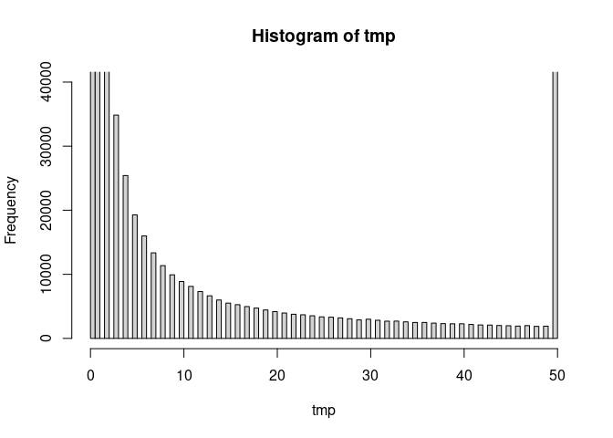

RNAseq quantifications

    rpm_znf = transform(apply(count, 2, function(vec) {
        vec/sum(vec) * 1e+06
    }), row.names = rownames(count))
    fpkm_znf = calculate_fpkm(count, gene_anno)
    fpkm_uq_znf = calculate_uqfpkm(count, gene_anno)
    tpm_znf = calculate_tpm(count, gene_anno)
    ltpm_znf = log2(tpm_znf + 0.1)

Explorative analysis of global patterns (PCA) quality control \#1

    # PCA
    ggplot(data.frame(mean = rowMeans(ltpm_znf), sd = rowSds(ltpm_znf)),
        aes(x = mean, y = sd)) + stat_density_2d(aes(fill = ..level..),
        geom = "polygon", colour = "white")

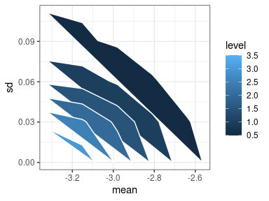

    keep_gene = rowSds(ltpm_znf) > 0.5 & rowMeans(ltpm_znf) > -0.5

    pca = prcomp(t(ltpm_znf[keep_gene, ]))
    summary(pca)

    ## Importance of components:
    ##                            PC1     PC2      PC3      PC4      PC5      PC6
    ## Standard deviation     21.8251 17.8177 12.93660 11.32374 10.34005 10.22452
    ## Proportion of Variance  0.1762  0.1175  0.06192  0.04744  0.03956  0.03868
    ## Cumulative Proportion   0.1762  0.2937  0.35561  0.40305  0.44261  0.48128
    ##                            PC7     PC8     PC9    PC10    PC11    PC12    PC13
    ## Standard deviation     9.68617 9.04835 8.67799 8.54684 8.25448 8.22377 8.14660
    ## Proportion of Variance 0.03471 0.03029 0.02786 0.02703 0.02521 0.02502 0.02455
    ## Cumulative Proportion  0.51600 0.54629 0.57415 0.60118 0.62639 0.65141 0.67596
    ##                           PC14    PC15    PC16    PC17    PC18   PC19    PC20
    ## Standard deviation     7.86527 7.78741 7.62628 7.61886 7.34518 7.1845 7.11082
    ## Proportion of Variance 0.02289 0.02244 0.02152 0.02148 0.01996 0.0191 0.01871
    ## Cumulative Proportion  0.69885 0.72129 0.74280 0.76428 0.78424 0.8033 0.82205
    ##                          PC21   PC22    PC23    PC24    PC25    PC26    PC27
    ## Standard deviation     6.9364 6.8978 6.78219 6.58383 6.54741 6.49785 6.33926
    ## Proportion of Variance 0.0178 0.0176 0.01702 0.01604 0.01586 0.01562 0.01487
    ## Cumulative Proportion  0.8398 0.8575 0.87447 0.89051 0.90637 0.92199 0.93686
    ##                           PC28    PC29    PC30    PC31   PC32      PC33
    ## Standard deviation     6.18037 5.99887 5.91707 5.79957 5.2763 9.692e-15
    ## Proportion of Variance 0.01413 0.01331 0.01295 0.01244 0.0103 0.000e+00
    ## Cumulative Proportion  0.95099 0.96430 0.97726 0.98970 1.0000 1.000e+00

    pdata = transform(as.data.frame(pca$x), group = sample_sheet_znf$group)
    ggplot(pdata, aes(PC1, PC2, color = group)) + geom_point() +
        xlab(paste("PC1 (", round(summary(pca)$importance[2, 1] *
            100, 1), "%)", sep = "")) + ylab(paste("PC2 (", round(summary(pca)$importance[2,
        2] * 100, 1), "%)", sep = ""))

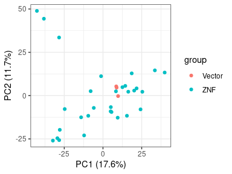

    ggplot(pdata, aes(PC1, PC3, color = group)) + geom_point() +
        xlab(paste("PC1 (", round(summary(pca)$importance[2, 1] *
            100, 1), "%)", sep = "")) + ylab(paste("PC3 (", round(summary(pca)$importance[2,
        3] * 100, 1), "%)", sep = ""))

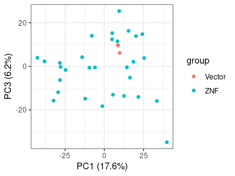

Replicating figure S7F in the original paper. Quality control \#2

    ## Calculate log2 fold change
    ind_vector = which(sample_sheet_znf$group == "Vector")
    ind_znf = which(sample_sheet_znf$group == "ZNF")

    vector_mean = rowMeans(ltpm_znf[, ind_vector])
    l2fc_znf = apply(ltpm_znf[, ind_znf], 2, function(g) {
        g - vector_mean
    })
    colnames(l2fc_znf) = sample_sheet_znf[ind_znf, "genotype.variation"]

    ## Calculate pairwise correlation
    cor_table = apply(l2fc_znf[keep_gene, ], 2, function(g1) {
        apply(l2fc_znf[keep_gene, ], 2, function(g2) {
            cor(g1, g2, method = "spearman")
        })
    })

    pheatmap(cor_table, clustering_distance_cols = "euclidean", cluster_method = "ward.D",
        border_color = "white", colorRampPalette(c("navy", "white",
            "red"))(100), breaks = seq(-0.8, 0.8, length.out = 100))

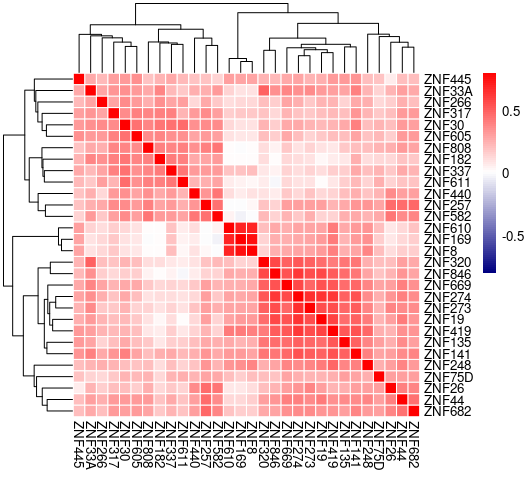

Confirm ZNF gene over-expressions at RNA level. Quality control \#3

    pdata = data.frame(kznf = colnames(l2fc_znf), l2fc = sapply(colnames(l2fc_znf),
        function(gene) {
            id = rownames(gene_anno)[match(gene, gene_anno[, "Symbol"])]
            l2fc = l2fc_znf[id, gene]
        }))

    ggplot(pdata, aes(kznf, l2fc)) + geom_bar(stat = "identity") +
        geom_hline(yintercept = 0.5, linetype = "dotted", color = "red") +
        theme(axis.title.x = element_blank(), axis.text.x = element_text(angle = 45,
            hjust = 1))

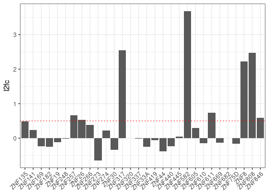

Correlating l2fc upon KZNF over-expression with m knock-down

    ## combine tables of l2fc and ltpm

    l2fc_m = l2fc
    l2fc_dtag = cbind(deseq_results[[25]]$log2FoldChange, deseq_results[[28]]$log2FoldChange,
        deseq_results[[29]]$log2FoldChange, deseq_results[[32]]$log2FoldChange)
    rownames(l2fc_dtag) = rownames(annotations$gene_anno)[match(deseq_results[[25]]$Symbol,
        annotations$gene_anno$Symbol)]
    colnames(l2fc_dtag) = c("EtOH_10h", "Tam_10h", "EtOH_20h", "Tam_20h")

    rn = intersect(intersect(rownames(l2fc_znf), rownames(l2fc_m)),
        rownames(l2fc_dtag))
    l2fc_cb = na.omit(cbind(l2fc_znf[rn, ], l2fc_m[rn, ], l2fc_dtag[rn,
        ]))
    rn = rownames(l2fc_cb)

    ltpm_cb = cbind(ltpm_znf[rn, ], tables$ltpm[rn, ], rna_tables$ltpm[rn,
        ])

    ## check mean and standard deviations
    ggplot(data.frame(mean = rowMeans(ltpm_cb), sd = rowSds(ltpm_cb)),
        aes(x = mean, y = sd)) + stat_density_2d(aes(fill = ..level..),
        geom = "polygon", colour = "white")

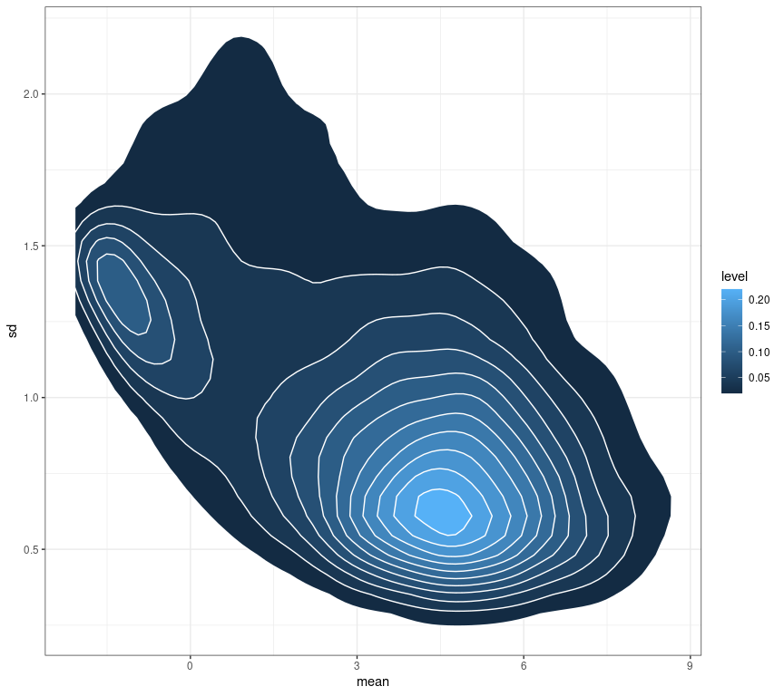

    ## Calculate pairwise correlation
    cor_table_cb = apply(l2fc_cb, 2, function(g1) {
        apply(l2fc_cb, 2, function(g2) {
            cor(g1, g2, method = "spearman")
        })
    })

    pheatmap(cor_table_cb, clustering_distance_cols = "euclidean",
        cluster_method = "ward.D", border_color = "white", colorRampPalette(c("navy",
            "white", "red"))(100), breaks = seq(-0.8, 0.8, length.out = 100))

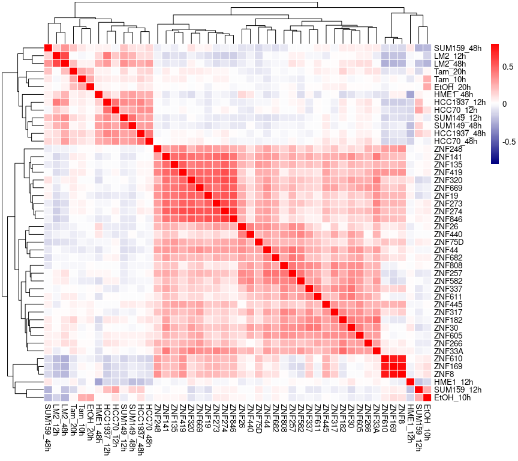
We noticed low global correlations.

Alternative hypothesis 1: specific KZNFs are more correlated than
others. Here I priorities KZNFs to better global correlations and
up-regulated themselves upon m perturbations.

1.  m perturbation in TNBC cell lines

<!-- -->

    ## for a given contrast, plot changes of ZNF themselves and
    ## transcriptional correlations
    contrast = "LM2_48h"

    pdata = data.frame(ZNF = sample_sheet_znf$genotype.variation[ind_znf],
        cor = cor_table_cb[1:length(ind_znf), contrast])
    znf_id = rownames(annotations$gene_anno)[match(sample_sheet_znf$genotype.variation[ind_znf],
        annotations$gene_anno$Symbol)]
    pdata = cbind(pdata, DESeq_results$res_sep_models$LM2$model_48h[znf_id,
        ])
    pdata$mlog10p = -log10(pdata$pvalue)
    pdata$sig = pdata$padj < 0.05

    ggplot(pdata, aes(log2FoldChange, cor)) + geom_point(aes(size = mlog10p,
        color = sig), alpha = 0.8) + geom_vline(xintercept = 0.4,
        linetype = "dashed") + geom_hline(yintercept = 0, linetype = "dashed") +
        # xlim(c(-35,35)) +
    ylim(c(-0.2, 0.2)) + geom_label_repel(data = subset(pdata, sig &
        cor > 0), aes(label = ZNF)) + xlab("Log2 fold change of ZNF") +
        ylab("Global correlations of log2 fold changes") + scale_colour_manual(values = c("grey",
        "#af3e4d"))

    ## Warning: Removed 4 rows containing missing values (geom_point).

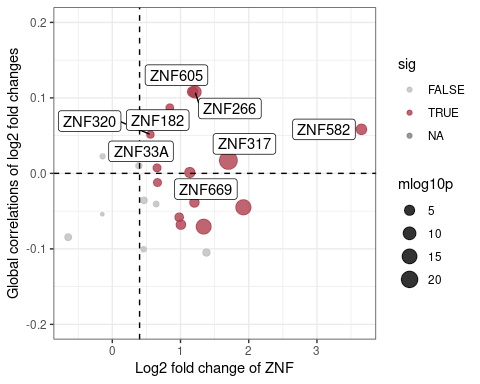

1.  m perturbation in normal breast epithelial cell lines

<!-- -->

    ## lot changes of ZNF themselves and transcriptional
    ## correlations (all contrasts combind but only plot
    ## significant ZNF changes)
    contrast = "Tam_20h"
    pdata = data.frame(ZNF = sample_sheet_znf$genotype.variation[ind_znf],
        cor = cor_table_cb[1:length(ind_znf), contrast])
    znf_id = match(sample_sheet_znf$genotype.variation[ind_znf],
        deseq_results[[32]]$Symbol)
    pdata = cbind(pdata, deseq_results[[32]][znf_id, ])
    pdata$mlog10p = -log10(pdata$pvalue)
    pdata$sig = pdata$padj < 0.05

    ggplot(pdata, aes(log2FoldChange, cor)) + geom_point(aes(size = mlog10p,
        color = sig), alpha = 0.8) + geom_vline(xintercept = 0.4,
        linetype = "dashed") + geom_hline(yintercept = 0, linetype = "dashed") +
        xlim(c(-0.5, 1)) + ylim(c(-0.2, 0.2)) + geom_label_repel(data = subset(pdata,
        sig & cor > 0), aes(label = ZNF)) + xlab("Log2 fold change of ZNF") +
        ylab("Global correlations of log2 fold changes") + scale_colour_manual(values = c("grey",
        "#af3e4d"))

    ## Warning: Removed 5 rows containing missing values (geom_point).

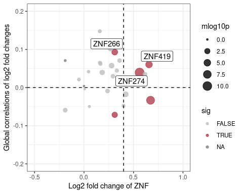

We noticed that ZNF266 has a higher correlation and up-regulations. And
also is consistent across models. So I took a deeper look into our own
RNAseq data and see how ZNF266 behave after m perturbations.

    plot_rnaseq("ZNF266")

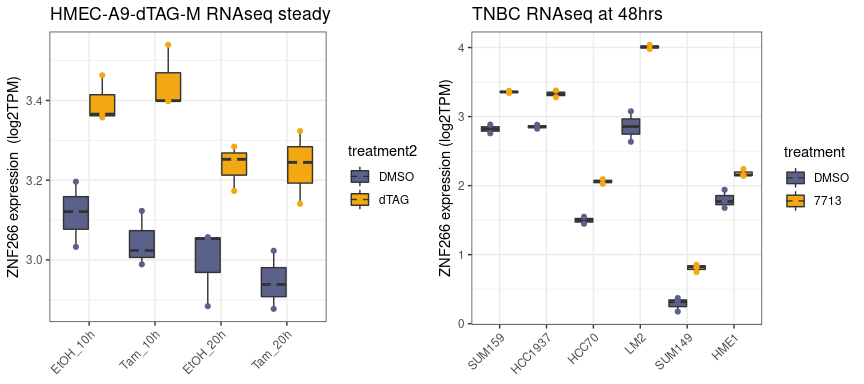

Get gene lists of commonly up-regulated and down-regulated genes

    g = "ZNF26"
    sample_sheet_znf[match(g, sample_sheet_znf$genotype.variation),
        ]

    ##     sample_id Cell_line genotype.variation group
    ## 6 SRR10662961      A549              ZNF26   ZNF

    sum(l2fc_znf[, g] > 1 & ltpm_znf[, "SRR10662962"] > -1)

    ## [1] 625

    goi_up = intersect(rownames(ltpm_znf)[l2fc_znf[, g] > 1 & ltpm_znf[,
        "SRR10662962"] > -1], rownames(l2fc_dtag))
    goi_up = gene_anno[goi_up, "Symbol"]

    # further filter by MPP8 regulation
    cat(intersect(goi_up, m_up_gene), sep = "; ")

    ## FBXO32; SYT11; PCSK7; GPNMB; TREH; COL4A5; SPOCK1; TBC1D2; CTIF; SPATA18; BTBD19; SP140L; PHLDB1; TAGLN; PGM2L1; TSPAN10; PLXNA3; NEXN; SLC12A8

    goi_dn = intersect(rownames(ltpm_znf)[l2fc_znf[, g] < -1 & ltpm_znf[,
        "SRR10662962"] > -1], rownames(l2fc_dtag))
    goi_dn = gene_anno[goi_dn, "Symbol"]

    # further filter by MPP8 regulation
    cat(intersect(goi_dn, m_dn_gene), sep = "; ")

    ## ERRFI1; VGF; HES7; PTGS2; MBOAT1; CXCL8; FGFBP1; ADORA1; AQP3; ST3GAL1; FOXQ1; SLC16A7; PCSK9; DUSP5; FOSL1; BCL2L15; CA9; AGR2; KCNS3; HHIP; TENM4; KRT15; OAS1; CXCL1; SERPINA3; ZNF704; AREG; TJP3; FUT1; SEMA6B; CORO1A; SCNN1B; KRT19; EHF; VAV3; CEACAM1; UNC13D; FOS; COL12A1; EMP1; CD24

Run GSEA on REACTOME (mSigDB) genesets on ranks by l2fc of ZNF266

    set.seed(785)
    g = "ZNF266"

    # get pathway annotations
    pathways = gmtPathways("/storage/westbrook/public_datasets/msigdb/c2.all.v7.4.symbols.gmt")
    pw = pathways[grep("REACTOME", names(pathways))]

    # calculate rank for protein coding genes
    l2fc_znf_pc = l2fc_znf[intersect(rownames(l2fc_znf), rownames(l2fc_dtag)),
        ]
    rank = sort(l2fc_znf_pc[, g])
    names(rank) = annotations$gene_anno[names(rank), "Symbol"]

    # fun fgsea
    output = fgseaMultilevel(pw, rank, eps = 0, minSize = 10, maxSize = 500)

    ## Warning in preparePathwaysAndStats(pathways, stats, minSize, maxSize, gseaParam, : There are ties in the preranked stats (0.24% of the list).
    ## The order of those tied genes will be arbitrary, which may produce unexpected results.

    # organise results for visualization

    fgseaResTidy <- output %>%
        as_tibble() %>%
        arrange(desc(NES))

    fgseaResTidy = fgseaResTidy[!is.nan(fgseaResTidy$NES), ]
    pdata = rbind(head(fgseaResTidy, 10), tail(fgseaResTidy, 10))
    pdata$sig = factor(pdata$padj < 0.05, levels = c("TRUE", "FALSE"))

    ggplot(pdata, aes(reorder(pathway, NES), NES)) + geom_col(aes(fill = sig)) +
        coord_flip() + labs(x = "Pathway", y = "Normalized Enrichment Score",
        title = "Reactome pathways NES from GSEA", fill = "padj < 0.05") +
        theme_bw() + scale_fill_manual(values = c("red", "grey"))

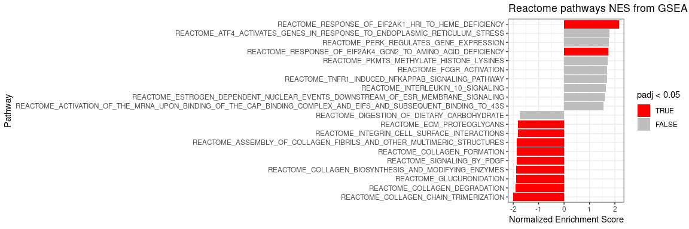

    plotEnrichment(pathways[["REACTOME_NUCLEAR_EVENTS_KINASE_AND_TRANSCRIPTION_FACTOR_ACTIVATION"]],
        rank)

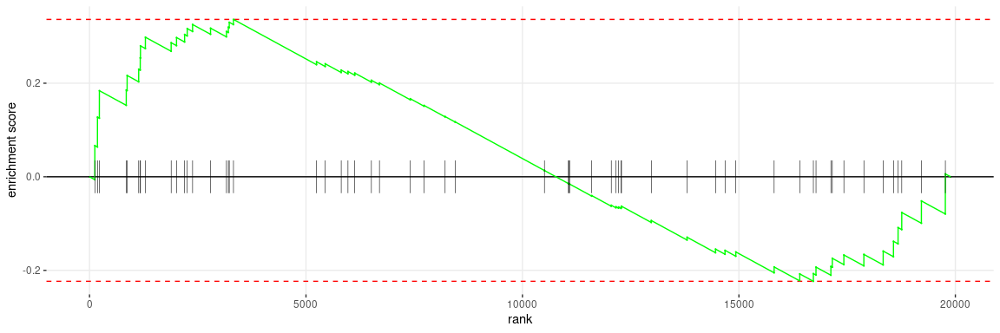

Alternative hypothesis 2: only a small subset of genes respond to KZNF
overexpression are important.

Then I need a summary metric for the overall effect of KZNF
over-expression on each gene. Here I present two methods 1. k-means
clustering of genes to 3 groups: KZNF up, KZNF dn, and KZNF unchanged 2.
median l2fc of each gene across 30 KZNF overexpression and see which
genes are most consistently up-regulated by KZNF and M knock-down

    set.seed(755)
    l2fc_znf_pc = l2fc_znf[intersect(rownames(l2fc_znf), rownames(l2fc_dtag)),]
    l2fc_znf_pc_f = l2fc_znf_pc[rowMeans(ltpm_znf[rownames(l2fc_znf_pc),]) > -1,]

    pheatmap(l2fc_znf_pc_f,
             clustering_distance_cols = 'euclidean',
             clustering_distance_rows = 'euclidean',
             kmeans_k = 3,
             cluster_method = 'ward.D',
             border_color = 'white',
             colorRampPalette(c("navy", "white", "red"))(100),
             breaks = seq(-2, 2, length.out = 100),
             show_rownames = F
             
             )

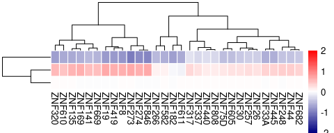

    km = kmeans(l2fc_znf_pc_f,3)

    univ = annotations$gene_anno[intersect(rownames(l2fc_znf_pc_f), all_gene_id),"Symbol"]

    kznf_up_cons = annotations$gene_anno[names(km$cluster)[km$cluster == 2],"Symbol"]
    phyper(q = length(intersect(kznf_up_cons, m_up_gene)),
           m = length(intersect(univ, kznf_up_cons)),
           n = length(univ) - length(intersect(univ, kznf_up_cons)),
           k = length(intersect(univ, m_up_gene)),
           lower.tail = FALSE)

    ## [1] 0.03584609

    kznf_dn_cons = annotations$gene_anno[names(km$cluster)[km$cluster == 3],"Symbol"]
    phyper(q = length(intersect(kznf_dn_cons, m_dn_gene)),
           m = length(intersect(univ, kznf_dn_cons)),
           n = length(univ) - length(intersect(univ, kznf_dn_cons)),
           k = length(intersect(univ, m_dn_gene)),
           lower.tail = FALSE)

    ## [1] 0.05170633

Some QC to compare k-means method and l2fc method

    ## Plot distributions of median l2fc

    hist(rowMedians(l2fc_znf[rn, ]), breaks = 500, xlim = c(-2, 2))

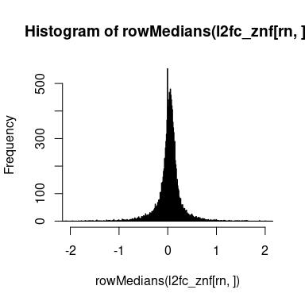

    ## comparing kmeans and median l2fc

    pdata = data.frame(row.names = rn, gene = annotations$gene_anno[rn,
        "Symbol"], znf_median_l2fc = rowMedians(l2fc_znf[rn, ]),
        kmeans_cluster = as.factor(km$cluster[rn]))
    gene_id = match(annotations$gene_anno[rn, "Symbol"], deseq_results[[32]]$Symbol)

    pdata = na.omit(pdata)
    ggplot(pdata, aes(kmeans_cluster, znf_median_l2fc, fill = kmeans_cluster)) +
        geom_violin() + geom_hline(yintercept = c(-0.3, 0.3), linetype = "dashed") +
        scale_fill_manual(values = c("grey", "red", "navy")) + theme_bw()

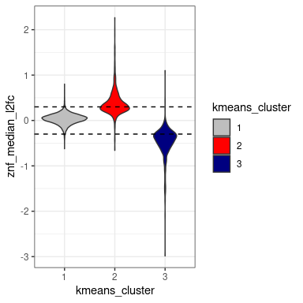
Using median l2fc to identify commonly regulated genes in normal
epithelial cells

    pdata = data.frame(row.names = rn, gene = annotations$gene_anno[rn,
        "Symbol"], znf_median_l2fc = rowMedians(l2fc_znf[rn, ]))
    gene_id = match(annotations$gene_anno[rn, "Symbol"], deseq_results[[32]]$Symbol)
    pdata = cbind(pdata, deseq_results[[32]][gene_id, ])
    pdata$mlog10p = -log10(pdata$pvalue)
    pdata$sig = "none"
    pdata$sig[with(pdata, padj < 0.05 & log2FoldChange > 0.5 & znf_median_l2fc >
        0.3)] = "up"
    pdata$sig[with(pdata, padj < 0.05 & log2FoldChange < -0.5 & znf_median_l2fc <
        -0.3)] = "dn"
    pdata$sig = factor(pdata$sig, levels = c("none", "up", "dn"),
        ordered = T)

    ggplot(pdata, aes(znf_median_l2fc, log2FoldChange)) + geom_point(aes(size = mlog10p,
        color = sig), alpha = 0.8) + geom_vline(xintercept = c(-0.3,
        0.3), linetype = "dashed") + geom_hline(yintercept = c(-0.5,
        0.5), linetype = "dashed") + xlim(c(-2, 2)) + xlab("median Log2 fold change KZNF overexpression") +
        ylab("log2 fold changes (A9 dTAG vs DMSO at 20 hours)") +
        scale_colour_manual(values = c("grey", "#af3e4d", "#094074"))

    ## Warning: Removed 4 rows containing missing values (geom_point).

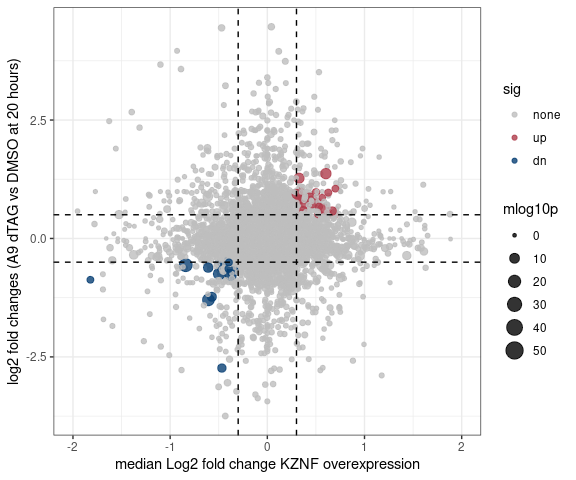

    ggplot(pdata, aes(znf_median_l2fc, log2FoldChange)) + geom_point(aes(size = mlog10p,
        color = sig), alpha = 0.8) + geom_vline(xintercept = c(-0.3,
        0.3), linetype = "dashed") + geom_hline(yintercept = c(-0.5,
        0.5), linetype = "dashed") + xlim(c(-2, 2)) + geom_label_repel(data = subset(pdata,
        sig != "none"), aes(label = gene), max.overlaps = Inf) +
        xlab("median Log2 fold change KZNF overexpression") + ylab("log2 fold changes (A9 dTAG vs DMSO at 20 hours)") +
        scale_colour_manual(values = c("grey", "#af3e4d", "#094074"))

    ## Warning: Removed 4 rows containing missing values (geom_point).

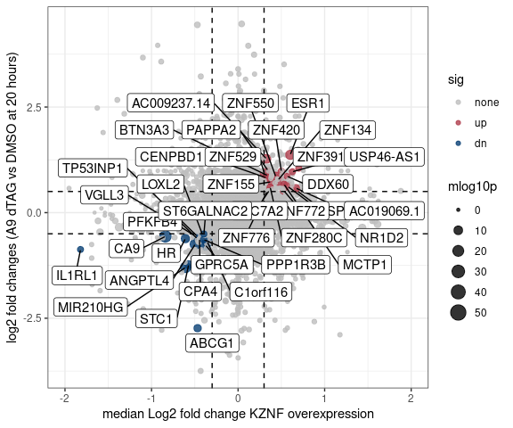
Using median l2fc to identify commonly regulated genes in TNBC cells

    pdata = data.frame(row.names = rn, gene = annotations$gene_anno[rn,
        "Symbol"], znf_median_l2fc = rowMedians(l2fc_znf[rn, ]))
    pdata = cbind(pdata, DESeq_results$res_sep_models$LM2$model_48h[rn,
        ])
    pdata$mlog10p = -log10(pdata$pvalue)
    pdata$sig = "none"
    pdata$sig[with(pdata, padj < 0.05 & log2FoldChange > 0.5 & znf_median_l2fc >
        0.3)] = "up"
    pdata$sig[with(pdata, padj < 0.05 & log2FoldChange < -0.5 & znf_median_l2fc <
        -0.3)] = "dn"
    pdata$sig = factor(pdata$sig, levels = c("none", "up", "dn"),
        ordered = T)

    ggplot(pdata, aes(znf_median_l2fc, log2FoldChange)) + geom_point(aes(size = mlog10p,
        color = sig), alpha = 0.8) + geom_vline(xintercept = c(-0.3,
        0.3), linetype = "dashed") + geom_hline(yintercept = c(-0.5,
        0.5), linetype = "dashed") + xlim(c(-2, 2)) + xlab("median Log2 fold change KZNF overexpression") +
        ylab("log2 fold changes (LM2 7713 vs veh at 48 hours)") +
        scale_colour_manual(values = c("grey", "#af3e4d", "#094074"))

    ## Warning: Removed 4 rows containing missing values (geom_point).

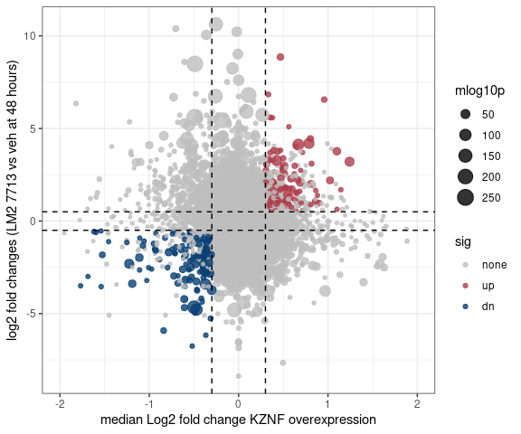

    ggplot(pdata, aes(znf_median_l2fc, log2FoldChange)) + geom_point(aes(size = mlog10p,
        color = sig), alpha = 0.8) + geom_vline(xintercept = c(-0.3,
        0.3), linetype = "dashed") + geom_hline(yintercept = c(-0.5,
        0.5), linetype = "dashed") + xlim(c(-2, 2)) + geom_label_repel(data = subset(pdata,
        sig != "none" & (abs(znf_median_l2fc) > 0.6 & abs(log2FoldChange) >
            3)), aes(label = gene), max.overlaps = Inf) + xlab("median Log2 fold change KZNF overexpression") +
        ylab("log2 fold changes (LM2 7713 vs veh at 48 hours)") +
        scale_colour_manual(values = c("grey", "#af3e4d", "#094074"))

    ## Warning: Removed 4 rows containing missing values (geom_point).

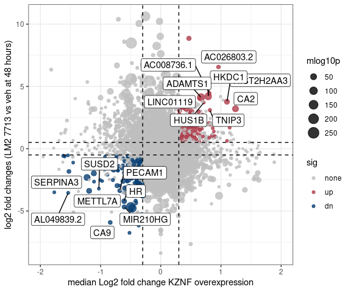
Visualize gene expression changes using heatmap to test specific
hypothesis. Here I used an example of TRAIL apoptosis geneset.

    gsc = getBroadSets("/storage/westbrook/public_datasets/msigdb/msigdb_v7.4.xml")
    types = sapply(gsc, function(elt) bcCategory(collectionType(elt)))
    c2gsc = gsc[types == "c2"]

    trail_up = na.omit(rownames(annotations$gene_anno)[match(geneIds(c2gsc[["HAMAI_APOPTOSIS_VIA_TRAIL_UP"]]), annotations$gene_anno$Symbol)])
    trail_dn = na.omit(rownames(annotations$gene_anno)[match(geneIds(c2gsc[["HAMAI_APOPTOSIS_VIA_TRAIL_DN"]]), annotations$gene_anno$Symbol)])

    pheatmap(l2fc_znf_pc_f[intersect(trail_up, rownames(l2fc_znf_pc_f)),],
             clustering_distance_cols = 'euclidean',
             cluster_method = 'ward.D',
             border_color = 'white',
             colorRampPalette(c("navy", "white", "red"))(100),
             breaks = seq(-3, 3, length.out = 100),
             show_rownames = F
             
             )

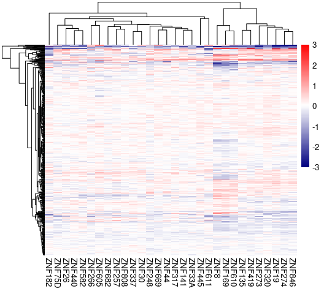

    pheatmap(l2fc_znf_pc_f[intersect(trail_dn, rownames(l2fc_znf_pc_f)),],
             clustering_distance_cols = 'euclidean',
             cluster_method = 'ward.D',
             border_color = 'white',
             colorRampPalette(c("navy", "white", "red"))(100),
             breaks = seq(-3, 3, length.out = 100),
             show_rownames = F
             
             )

Plot family level changes of repetitive elements

    repeat_genes = intersect(rownames(ltpm_znf), rownames(repeats_anno))

    family_level_ltpm = log2(transform(aggregate(tpm_znf[repeat_genes,
        ], by = list(repeats_anno[repeat_genes, "family_id"]), FUN = sum),
        row.names = 1) + 0.1)
    colnames(family_level_ltpm) = sample_sheet_znf$genotype.variation

    vector_mean_repeats = rowMeans(family_level_ltpm[, ind_vector])
    l2fc_znf_repeats = apply(family_level_ltpm[, ind_znf], 2, function(g) {
        g - vector_mean_repeats
    })

    pheatmap(l2fc_znf_repeats, clustering_distance_cols = "euclidean",
        cluster_method = "ward.D", border_color = "white", colorRampPalette(c("navy",
            "white", "red"))(100), breaks = seq(-2, 2, length.out = 100),
        show_rownames = T, annotation_row = data.frame(vector_mean_repeats))

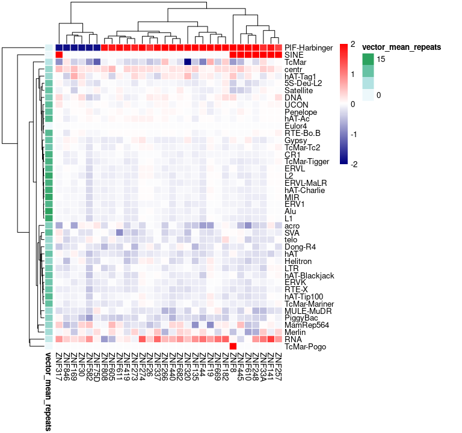

    sessionInfo()

    ## R version 4.1.0 (2021-05-18)
    ## Platform: x86_64-pc-linux-gnu (64-bit)
    ## Running under: Red Hat Enterprise Linux Server 7.9 (Maipo)
    ## 
    ## Matrix products: default
    ## BLAS/LAPACK: /usr/lib64/libopenblas-r0.3.3.so
    ## 
    ## locale:
    ##  [1] LC_CTYPE=en_US.UTF-8       LC_NUMERIC=C              
    ##  [3] LC_TIME=en_US.UTF-8        LC_COLLATE=en_US.UTF-8    
    ##  [5] LC_MONETARY=en_US.UTF-8    LC_MESSAGES=en_US.UTF-8   
    ##  [7] LC_PAPER=en_US.UTF-8       LC_NAME=C                 
    ##  [9] LC_ADDRESS=C               LC_TELEPHONE=C            
    ## [11] LC_MEASUREMENT=en_US.UTF-8 LC_IDENTIFICATION=C       
    ## 
    ## attached base packages:
    ## [1] stats4    parallel  stats     graphics  grDevices utils     datasets 
    ## [8] methods   base     
    ## 
    ## other attached packages:
    ##  [1] fgsea_1.18.0         GSEABase_1.54.0      graph_1.70.0        
    ##  [4] annotate_1.70.0      XML_3.99-0.8         AnnotationDbi_1.54.1
    ##  [7] IRanges_2.26.0       S4Vectors_0.30.2     Biobase_2.52.0      
    ## [10] BiocGenerics_0.38.0  GSVA_1.40.1          ggrepel_0.9.1       
    ## [13] pheatmap_1.0.12      matrixStats_0.61.0   forcats_0.5.1       
    ## [16] stringr_1.4.0        dplyr_1.0.9          purrr_0.3.4         
    ## [19] readr_2.0.1          tidyr_1.1.4          tibble_3.1.7        
    ## [22] ggplot2_3.3.6        tidyverse_1.3.1     
    ## 
    ## loaded via a namespace (and not attached):
    ##  [1] colorspace_2.0-3            ellipsis_0.3.2             
    ##  [3] XVector_0.32.0              GenomicRanges_1.44.0       
    ##  [5] fs_1.5.2                    rstudioapi_0.13            
    ##  [7] farver_2.1.0                bit64_4.0.5                
    ##  [9] fansi_1.0.3                 lubridate_1.8.0            
    ## [11] xml2_1.3.3                  codetools_0.2-18           
    ## [13] sparseMatrixStats_1.4.2     cachem_1.0.6               
    ## [15] knitr_1.39                  jsonlite_1.8.0             
    ## [17] broom_0.8.0                 dbplyr_2.2.0               
    ## [19] png_0.1-7                   HDF5Array_1.20.0           
    ## [21] compiler_4.1.0              httr_1.4.3                 
    ## [23] backports_1.4.1             assertthat_0.2.1           
    ## [25] Matrix_1.3-3                fastmap_1.1.0              
    ## [27] cli_3.3.0                   BiocSingular_1.8.1         
    ## [29] formatR_1.12                htmltools_0.5.2            
    ## [31] tools_4.1.0                 rsvd_1.0.5                 
    ## [33] gtable_0.3.0                glue_1.6.2                 
    ## [35] GenomeInfoDbData_1.2.6      fastmatch_1.1-3            
    ## [37] Rcpp_1.0.8                  cellranger_1.1.0           
    ## [39] vctrs_0.4.1                 Biostrings_2.60.2          
    ## [41] rhdf5filters_1.4.0          DelayedMatrixStats_1.14.3  
    ## [43] xfun_0.29                   beachmat_2.8.1             
    ## [45] rvest_1.0.2                 lifecycle_1.0.1            
    ## [47] irlba_2.3.5                 zlibbioc_1.38.0            
    ## [49] scales_1.2.0                hms_1.1.1                  
    ## [51] MatrixGenerics_1.4.3        SummarizedExperiment_1.22.0
    ## [53] rhdf5_2.36.0                RColorBrewer_1.1-3         
    ## [55] SingleCellExperiment_1.14.1 yaml_2.2.2                 
    ## [57] memoise_2.0.1               gridExtra_2.3              
    ## [59] stringi_1.7.6               RSQLite_2.2.8              
    ## [61] highr_0.9                   ScaledMatrix_1.0.0         
    ## [63] BiocParallel_1.26.2         GenomeInfoDb_1.28.4        
    ## [65] rlang_1.0.2                 pkgconfig_2.0.3            
    ## [67] bitops_1.0-7                evaluate_0.15              
    ## [69] lattice_0.20-44             Rhdf5lib_1.14.2            
    ## [71] labeling_0.4.2              bit_4.0.4                  
    ## [73] tidyselect_1.1.2            magrittr_2.0.3             
    ## [75] R6_2.5.1                    generics_0.1.2             
    ## [77] DelayedArray_0.18.0         DBI_1.1.3                  
    ## [79] pillar_1.7.0                haven_2.4.3                
    ## [81] withr_2.5.0                 KEGGREST_1.32.0            
    ## [83] RCurl_1.98-1.5              modelr_0.1.8               
    ## [85] crayon_1.5.1                utf8_1.2.2                 
    ## [87] tzdb_0.2.0                  rmarkdown_2.14             
    ## [89] grid_4.1.0                  readxl_1.4.0               
    ## [91] data.table_1.14.2           blob_1.2.3                 
    ## [93] reprex_2.0.1                digest_0.6.29              
    ## [95] xtable_1.8-4                munsell_0.5.0
