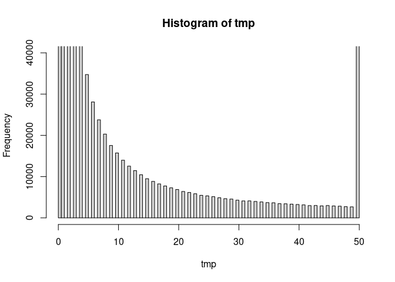
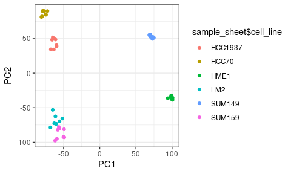

Define functions for quantifications

    calculate_uqfpkm = function(count_table, gene_anno) {
        # calculate uqfpkm, note that the rows in gene_anno is
        # required to be the same in count_table ##

        return = apply(count_table, 2, function(readcount) {
            readcount = as.numeric(readcount)
            uq75 = quantile(readcount, 0.75)
            fpkm_uq = readcount * 10^9/(gene_anno$median * uq75)
        })
        rownames(return) = rownames(gene_anno)
        return
    }
    calculate_fpkm = function(count_table, gene_anno) {
        # calculate uqfpkm, note that the rows in gene_anno is
        # required to be the same in count_table ##

        return = apply(count_table, 2, function(readcount) {
            readcount = as.numeric(readcount)
            sum_library = sum(readcount)
            fpkm = readcount * 10^9/(gene_anno$median * sum_library)
        })
        rownames(return) = rownames(gene_anno)
        return
    }
    calculate_tpm = function(count_table, gene_anno) {
        # calculate tpm, note that the rows in gene_anno is
        # required to be the same in count_table ##

        return = apply(count_table, 2, function(readcount) {
            readcount = as.numeric(readcount)
            rpk = readcount * 10^3/gene_anno$median
            tpm = rpk * 10^6/sum(rpk)
        })
        rownames(return) = rownames(gene_anno)
        return
    }

Load count matrix

format and filter count matrix for quantifications

    cnt = as.matrix(cnt)
    cnt = cnt[rowSums(cnt) > 0, ]
    colnames(cnt) = sample_sheet$sample_id
    rownames(cnt) = str_split(str_split(rownames(cnt), ":", simplify = T)[,
        1], "[.]", simplify = T)[, 1]

    gene_len$gene = str_split(gene_len$gene, "[.]", simplify = T)[,
        1]
    gene_len = gene_len[!duplicated(gene_len$gene), ]
    mart = transform(mart[!duplicated(mart$Gene.stable.ID), ], row.names = 1)
    gene_anno = transform(rbind(gene_len, repeat_len), row.names = 1)

    all_genes = intersect(rownames(gene_anno), rownames(cnt))

    count = cnt[all_genes, ]
    gene_anno = gene_anno[all_genes, ]
    gene_anno$Symbol = mart[all_genes, "Gene.name"]
    gene_anno$Symbol[gene_anno$Symbol == "" | is.na(gene_anno$Symbol)] = rownames(gene_anno)[gene_anno$Symbol ==
        "" | is.na(gene_anno$Symbol)]

count matrix QC

    tmp = as.matrix(count)
    tmp[tmp > 50] = 50
    hist(tmp, breaks = 100, ylim = c(0, 40000))

Quantification for gene expression

    rpm = transform(apply(count, 2, function(vec) {
        vec/sum(vec) * 1e+06
    }), row.names = rownames(count))
    fpkm = calculate_fpkm(count, gene_anno)
    fpkm_uq = calculate_uqfpkm(count, gene_anno)
    tpm = calculate_tpm(count, gene_anno)
    ltpm = log2(tpm + 0.1)

    tmp = log2(tpm[, 1] + 1)
    hist(tmp, breaks = 20)

    sum(tmp > 4)

    ## [1] 8022

Explorative analysis to see how global patterns separate cell lines,
time-points and treatment by inhibitor. Using PCA

    # PCA
    plot(rowMeans(ltpm), rowSds(ltpm))

    keep_gene = rowSds(ltpm) > 1 & rowMeans(ltpm) > 1

    pca = prcomp(t(ltpm[keep_gene, ]))
    summary(pca)

    ## Importance of components:
    ##                            PC1     PC2     PC3      PC4      PC5      PC6
    ## Standard deviation     75.4460 63.7129 41.8851 34.29761 32.65489 16.10381
    ## Proportion of Variance  0.3802  0.2711  0.1172  0.07856  0.07122  0.01732
    ## Cumulative Proportion   0.3802  0.6513  0.7684  0.84701  0.91823  0.93555
    ##                             PC7     PC8     PC9    PC10    PC11   PC12    PC13
    ## Standard deviation     13.69348 8.45901 8.19630 6.99811 6.37671 5.8695 5.70351
    ## Proportion of Variance  0.01252 0.00478 0.00449 0.00327 0.00272 0.0023 0.00217
    ## Cumulative Proportion   0.94807 0.95285 0.95734 0.96061 0.96332 0.9656 0.96780
    ##                          PC14    PC15    PC16    PC17    PC18    PC19    PC20
    ## Standard deviation     5.3396 5.13514 4.96570 4.87524 4.45762 4.37722 4.11557
    ## Proportion of Variance 0.0019 0.00176 0.00165 0.00159 0.00133 0.00128 0.00113
    ## Cumulative Proportion  0.9697 0.97146 0.97311 0.97470 0.97602 0.97730 0.97843
    ##                           PC21    PC22    PC23    PC24    PC25    PC26    PC27
    ## Standard deviation     4.09717 3.94843 3.91627 3.85387 3.72142 3.61447 3.57942
    ## Proportion of Variance 0.00112 0.00104 0.00102 0.00099 0.00092 0.00087 0.00086
    ## Cumulative Proportion  0.97956 0.98060 0.98162 0.98261 0.98354 0.98441 0.98527
    ##                           PC28    PC29    PC30   PC31    PC32    PC33    PC34
    ## Standard deviation     3.47184 3.39151 3.36175 3.2282 3.19788 3.16056 3.14279
    ## Proportion of Variance 0.00081 0.00077 0.00075 0.0007 0.00068 0.00067 0.00066
    ## Cumulative Proportion  0.98607 0.98684 0.98759 0.9883 0.98897 0.98964 0.99030
    ##                           PC35    PC36    PC37    PC38    PC39    PC40    PC41
    ## Standard deviation     3.04648 3.03832 2.95262 2.93127 2.87700 2.86048 2.82093
    ## Proportion of Variance 0.00062 0.00062 0.00058 0.00057 0.00055 0.00055 0.00053
    ## Cumulative Proportion  0.99092 0.99154 0.99212 0.99269 0.99325 0.99379 0.99432
    ##                           PC42    PC43    PC44    PC45    PC46    PC47    PC48
    ## Standard deviation     2.76932 2.72032 2.65567 2.62482 2.55028 2.49691 2.46541
    ## Proportion of Variance 0.00051 0.00049 0.00047 0.00046 0.00043 0.00042 0.00041
    ## Cumulative Proportion  0.99484 0.99533 0.99580 0.99626 0.99670 0.99711 0.99752
    ##                          PC49    PC50    PC51    PC52    PC53    PC54    PC55
    ## Standard deviation     2.4436 2.38417 2.34619 2.32067 2.24677 2.23080 2.14437
    ## Proportion of Variance 0.0004 0.00038 0.00037 0.00036 0.00034 0.00033 0.00031
    ## Cumulative Proportion  0.9979 0.99830 0.99866 0.99902 0.99936 0.99969 1.00000
    ##                            PC56
    ## Standard deviation     3.35e-14
    ## Proportion of Variance 0.00e+00
    ## Cumulative Proportion  1.00e+00

    pdata = transform(as.data.frame(pca$x), cell_line = sample_sheet$cell_line,
        treatment = sample_sheet$treatment)
    ggplot(pdata, aes(PC1, PC2, color = cell_line, shape = treatment)) +
        geom_point() + xlab(paste("PC1 (", round(summary(pca)$importance[2,
        1] * 100, 1), "%)", sep = "")) + ylab(paste("PC2 (", round(summary(pca)$importance[2,
        2] * 100, 1), "%)", sep = "")) + theme_bw()

    ggplot(as.data.frame(pca$x), aes(PC1, PC2, color = sample_sheet$cell_line)) +
        geom_point()

    ggplot(as.data.frame(pca$x), aes(PC1, PC2, color = sample_sheet$time_point)) +
        geom_point()

    cell_line_list = unique(sample_sheet$cell_line)

    lapply(cell_line_list, function(cell_line) {
        keep_sample = sample_sheet$cell_line == cell_line
        pca = prcomp(t(ltpm[keep_gene, keep_sample]))
        pdata = transform(as.data.frame(pca$x), time_point = sample_sheet$time_point[keep_sample],
            treatment = sample_sheet$treatment[keep_sample])
        ggplot(pdata, aes(PC1, PC2, color = time_point, shape = treatment)) +
            geom_point() + xlab(paste("PC1 (", round(summary(pca)$importance[2,
            1] * 100, 1), "%)", sep = "")) + ylab(paste("PC2 (",
            round(summary(pca)$importance[2, 2] * 100, 1), "%)",
            sep = "")) + theme_bw()  #+ 
        # theme(legend.position='none')
    })

    ## [[1]]

    ## 
    ## [[2]]

    ## 
    ## [[3]]

    ## 
    ## [[4]]

    ## 
    ## [[5]]

    ## 
    ## [[6]]

Running an single DESeq2 model, using cell lines as co-variates

    keep_sample = sample_sheet$time_point == "12h"
    uni_model_12h = DESeqDataSetFromMatrix(countData = count[, keep_sample],
        colData = sample_sheet[keep_sample, ], design = ~treatment +
            cell_line)
    mcols(uni_model_12h) = DataFrame(mcols(uni_model_12h), gene_anno)
    uni_model_12h = DESeq(uni_model_12h)

    ## estimating size factors

    ## estimating dispersions

    ## gene-wise dispersion estimates

    ## mean-dispersion relationship

    ## final dispersion estimates

    ## fitting model and testing

    keep = sample_sheet$time_point == "48h"
    uni_model_48h = DESeqDataSetFromMatrix(countData = count[, keep_sample],
        colData = sample_sheet[keep_sample, ], design = ~treatment +
            cell_line)
    mcols(uni_model_48h) = DataFrame(mcols(uni_model_48h), gene_anno)
    uni_model_48h = DESeq(uni_model_48h)

    ## estimating size factors

    ## estimating dispersions

    ## gene-wise dispersion estimates

    ## mean-dispersion relationship

    ## final dispersion estimates

    ## fitting model and testing

Running separate DESeq2 models for each cell line.

    cell_line_list = unique(sample_sheet$cell_line)

    sep_models = lapply(cell_line_list, function(cell_line) {
        keep_sample = (sample_sheet$cell_line == cell_line) & (sample_sheet$time_point ==
            "12h")
        model_12h = DESeqDataSetFromMatrix(countData = count[, keep_sample],
            colData = sample_sheet[keep_sample, ], design = ~treatment)
        mcols(model_12h) = DataFrame(mcols(model_12h), gene_anno)

        keep_sample = (sample_sheet$cell_line == cell_line) & (sample_sheet$time_point ==
            "48h")
        model_48h = DESeqDataSetFromMatrix(countData = count[, keep_sample],
            colData = sample_sheet[keep_sample, ], design = ~treatment)
        mcols(model_48h) = DataFrame(mcols(model_48h), gene_anno)
        return = list(DESeq(model_12h), DESeq(model_48h))
        names(return) = c("model_12h", "model_48h")
        return
    })

    ## estimating size factors

    ## estimating dispersions

    ## gene-wise dispersion estimates

    ## mean-dispersion relationship

    ## final dispersion estimates

    ## fitting model and testing

    ## estimating size factors

    ## estimating dispersions

    ## gene-wise dispersion estimates

    ## mean-dispersion relationship

    ## final dispersion estimates

    ## fitting model and testing

    ## estimating size factors

    ## estimating dispersions

    ## gene-wise dispersion estimates

    ## mean-dispersion relationship

    ## final dispersion estimates

    ## fitting model and testing

    ## estimating size factors

    ## estimating dispersions

    ## gene-wise dispersion estimates

    ## mean-dispersion relationship

    ## final dispersion estimates

    ## fitting model and testing

    ## estimating size factors

    ## estimating dispersions

    ## gene-wise dispersion estimates

    ## mean-dispersion relationship

    ## final dispersion estimates

    ## fitting model and testing

    ## estimating size factors

    ## estimating dispersions

    ## gene-wise dispersion estimates

    ## mean-dispersion relationship

    ## final dispersion estimates

    ## fitting model and testing

    ## estimating size factors

    ## estimating dispersions

    ## gene-wise dispersion estimates

    ## mean-dispersion relationship

    ## final dispersion estimates

    ## fitting model and testing

    ## estimating size factors

    ## estimating dispersions

    ## gene-wise dispersion estimates

    ## mean-dispersion relationship

    ## final dispersion estimates

    ## fitting model and testing

    ## estimating size factors

    ## estimating dispersions

    ## gene-wise dispersion estimates

    ## mean-dispersion relationship

    ## final dispersion estimates

    ## fitting model and testing

    ## estimating size factors

    ## estimating dispersions

    ## gene-wise dispersion estimates

    ## mean-dispersion relationship

    ## final dispersion estimates

    ## fitting model and testing

    ## estimating size factors

    ## estimating dispersions

    ## gene-wise dispersion estimates

    ## mean-dispersion relationship

    ## final dispersion estimates

    ## fitting model and testing

    ## estimating size factors

    ## estimating dispersions

    ## gene-wise dispersion estimates

    ## mean-dispersion relationship

    ## final dispersion estimates

    ## fitting model and testing

    names(sep_models) = cell_line_list

Compile DESeq results

    res_sep_models = lapply(cell_line_list, function(cell_line) {
        res_12h = as.data.frame(results(sep_models[[cell_line]]$model_12h,
            contrast = c("treatment", "Inhibitor", "DMSO")))
        res_48h = as.data.frame(results(sep_models[[cell_line]]$model_48h,
            contrast = c("treatment", "Inhibitor", "DMSO")))
        return = list(res_12h, res_48h)
        names(return) = c("model_12h", "model_48h")
        return
    })
    names(res_sep_models) = cell_line_list
    res_uni_12h = as.data.frame(results(uni_model_12h, contrast = c("treatment",
        "Inhibitor", "DMSO")))
    res_uni_48h = as.data.frame(results(uni_model_48h, contrast = c("treatment",
        "Inhibitor", "DMSO")))

Generate significance flag tables for downstream analysis

    cutoff_l2fc = 0.5
    cutoff_lp = 5

    sigflag = Reduce(cbind, lapply(unique(sample_sheet$cell_line),
        function(cell_line) {
            return = data.frame(row.names = rownames(gene_anno))
            data = res_sep_models[[cell_line]]$model_12h

            return$flag_12h = 0
            return$flag_12h[data$log2FoldChange > cutoff_l2fc & -log10(data$padj) >
                cutoff_lp] = 1
            return$flag_12h[data$log2FoldChange < -cutoff_l2fc &
                -log10(data$pvalue) > cutoff_lp] = -1
            return$flag_12h[is.na(data$padj)] = 0

            data = res_sep_models[[cell_line]]$model_48h
            return$flag_48h = 0
            return$flag_48h[data$log2FoldChange > cutoff_l2fc & -log10(data$pvalue) >
                cutoff_lp] = 1
            return$flag_48h[data$log2FoldChange < -cutoff_l2fc &
                -log10(data$pvalue) > cutoff_lp] = -1
            return$flag_48h[is.na(data$padj)] = 0

            colnames(return) = paste(cell_line, colnames(return),
                sep = "_")
            return
        }))

    l2fc = Reduce(cbind, lapply(unique(sample_sheet$cell_line), function(cell_line) {
        return = cbind(res_sep_models[[cell_line]]$model_12h$log2FoldChange,
            res_sep_models[[cell_line]]$model_48h$log2FoldChange)
        rownames(return) = row.names = rownames(gene_anno)
        colnames(return) = paste(cell_line, c("12h", "48h"), sep = "_")
        return
    }))

QC number of differentially expressed genes in each cell line

    # number of total up-regulated and down-regulated genes

    hist(as.matrix(sigflag))

    # number of total up-regulated and down-regulated genes in
    # each cell line

    pdata = data.frame(contrast = rep(colnames(sigflag), each = 2),
        number_of_genes = as.numeric(sapply(sigflag, function(vec) {
            c(sum(vec > 0), sum(vec < 0))
        })), direction = rep(c("up", "down"), 6))

    ggplot(pdata, aes(contrast, number_of_genes, fill = direction)) +
        geom_bar(position = "dodge", stat = "identity") + scale_fill_manual(values = c("#094074",
        "#af3e4d")) + theme(axis.title.x = element_blank(), axis.text.x = element_text(angle = 45,
        hjust = 1))

Visualizing differential expressed genes by volcano plot

1.  12 hour plots

<!-- -->

    plots = lapply(unique(sample_sheet$cell_line), function(cell_line) {
        pdata = res_sep_models[[cell_line]]$model_12h
        pdata$Symbol = gene_anno$Symbol
        pdata = pdata[!is.na(pdata$padj), ]

        ml10pval = -log10(pdata$pvalue)
        ml10pval[ml10pval > 200] = 200
        pdata$ml10pval = ml10pval

        ggplot(pdata, aes(log2FoldChange, ml10pval, label = Symbol)) +
            geom_point(color = "grey") + geom_point(data = subset(pdata,
            log2FoldChange > cutoff_l2fc & ml10pval > cutoff_lp),
            color = mypal["ered"]) + geom_point(data = subset(pdata,
            -log2FoldChange > cutoff_l2fc & ml10pval > cutoff_lp),
            color = mypal["bcmblue"]) + geom_hline(yintercept = cutoff_lp,
            linetype = "dashed") + geom_vline(xintercept = c(-cutoff_l2fc,
            cutoff_l2fc), linetype = "dashed") + xlim(-5, 5) + ylab("-log10 P-value") +
            geom_label_repel(data = subset(pdata, (abs(log2FoldChange) >
                cutoff_l2fc & ml10pval > 50) | (abs(log2FoldChange) >
                2.5 & ml10pval > 25)), max.overlaps = 20) + ggtitle(paste(cell_line,
            "_12h", sep = ""), ) + theme_bw()
    })

    plots[[1]]

    plots[[2]]

    plots[[3]]

    plots[[4]]

    plots[[5]]

    plots[[6]]

1.  48 hour plots

<!-- -->

    plots = lapply(unique(sample_sheet$cell_line), function(cell_line) {
        pdata = res_sep_models[[cell_line]]$model_48h
        pdata$Symbol = gene_anno$Symbol
        pdata = pdata[!is.na(pdata$padj), ]

        ml10pval = -log10(pdata$pvalue)
        ml10pval[ml10pval > 200] = 200
        pdata$ml10pval = ml10pval

        ggplot(pdata, aes(log2FoldChange, ml10pval, label = Symbol)) +
            geom_point(color = "grey") + geom_point(data = subset(pdata,
            log2FoldChange > cutoff_l2fc & ml10pval > cutoff_lp),
            color = mypal["ered"]) + geom_point(data = subset(pdata,
            -log2FoldChange > cutoff_l2fc & ml10pval > cutoff_lp),
            color = mypal["bcmblue"]) + geom_hline(yintercept = cutoff_lp,
            linetype = "dashed") + geom_vline(xintercept = c(-cutoff_l2fc,
            cutoff_l2fc), linetype = "dashed") + xlim(-5, 5) + ylim(0,
            200) + ylab("-log10 P-value") + geom_label_repel(data = subset(pdata,
            (abs(log2FoldChange) > cutoff_l2fc & ml10pval > 50) |
                (abs(log2FoldChange) > 2.5 & ml10pval > 25)), max.overlaps = 20) +
            ggtitle(paste(cell_line, "_48h", sep = ""), ) + theme_bw()
    })

    plots[[1]]

    plots[[2]]

    plots[[3]]

    plots[[4]]

    plots[[5]]

    plots[[6]]

Plot heatmap for a selected set of genes (ltpm, z-scored).

    selected = rowSums(sigflag[,c(4,6,8)]) >= 2
    #selected = gene_anno$Symbol %in% znf & rowMins(tables$ltpm) > -1

    pdata = t(Reduce(rbind, list(scale(t(tables$ltpm[selected,which(sample_sheet$cell_line == "HME1")])), 
                   scale(t(tables$ltpm[selected,which(sample_sheet$cell_line == "SUM149")])),
                   scale(t(tables$ltpm[selected,which(sample_sheet$cell_line == "SUM159")])), 
                   scale(t(tables$ltpm[selected,which(sample_sheet$cell_line == "HCC70")])),
                   scale(t(tables$ltpm[selected,which(sample_sheet$cell_line == "HCC1937")])),
                   scale(t(tables$ltpm[selected,which(sample_sheet$cell_line == "LM2")]))
                   )))

    ann_colors = list(
        time_point = c("12h" = mypal[[5]], "48h" = mypal[[1]]),
        treatment = c("DMSO" = mypal[[2]], "Inhibitor" = mypal[[4]]),
        cell_line = c("HME1" = mypal[[3]], "SUM149" = mypal[[6]], "SUM159" = mypal[[7]], "HCC1937" = mypal[[8]], "HCC70" = mypal[[9]], "LM2" = mypal[[10]])
    )

    pheatmap(pdata,
             scale = 'none',
             border_color = 'grey',
             cellwidth = 20,
             cellheight = 2,
             cluster_rows = T,
             cluster_cols = F,
             clustering_distance_rows = 'euclidean',
             cluster_method = 'ward.D',
             cutree_rows = 5,
             gaps_col = c(3,6,6,9,12,12,15,18,18,21,24,24,26,28,28,30,32,32,34,36,36,38,40,40,42,44,44,46,48,48,50,52,52,54),
             show_rownames = F,
             show_colnames = F,
             #labels_col = sample_sheet$full_name,
             annotation_col = transform(sample_sheet, row.names = 1)[,c(2,3,1)],
             annotation_colors = ann_colors
             )

Plot heatmap for a selected set of genes (log2FoldChange, unscaled).

    selected = rowSums(sigflag[,c(4,6,8)]) >= 2
    #selected = gene_anno$Symbol %in% znf & rowMaxs(tables$ltpm) > 0
    pdata = t(l2fc[selected,])

    pdata[is.na(pdata)] = 0

    pheatmap(pdata,
             #color = colorRampPalette(rev(brewer.pal(n = 7, name = "RdBu")))(100),
             breaks = seq(-4, 4, length.out = 100),
             scale = 'none',
             border_color = 'grey',
             #cellwidth = 3,
             cellheight = 20,
             cluster_rows = F,
             cluster_cols = T,
             clustering_distance_cols = 'euclidean',
             cluster_method = 'ward.D',
             #cutree_cols = 8,
             gaps_col = c(2,4,6),
             labels_col = gene_anno$Symbol[selected],
             show_colnames = F,
             #labels_col = sample_sheet$full_name,
             #annotation_row = transform(sample_sheet, row.names = 1)[,c(3,2,1)],
             annotation_col = data.frame("M_bound" = (rownames(l2fc[selected,]) %in% m_peaks$Nearest.Ensembl)*1, row.names = rownames(l2fc[selected,]))
             #annotation_colors = ann_colors
             
             )

Plot heatmap for transposible elements at family level (ltpm, z-scored).

    repeat_genes = intersect(rownames(tables$tpm), rownames(repeats_anno))

    family_level_ltpm = log2(transform(aggregate(tables$tpm[repeat_genes,], by = list(repeats_anno[repeat_genes,"family_id"]), FUN = sum), row.names = 1) + 0.1)
    family_level_ltpm = family_level_ltpm[rowMeans(family_level_ltpm) > 0, ]

    pdata = t(Reduce(rbind, list(scale(t(family_level_ltpm[,which(sample_sheet$cell_line == "HME1")])), 
                   scale(t(family_level_ltpm[,which(sample_sheet$cell_line == "SUM149")])),
                   scale(t(family_level_ltpm[,which(sample_sheet$cell_line == "SUM159")])), 
                   scale(t(family_level_ltpm[,which(sample_sheet$cell_line == "HCC70")])),
                   scale(t(family_level_ltpm[,which(sample_sheet$cell_line == "HCC1937")])),
                   scale(t(family_level_ltpm[,which(sample_sheet$cell_line == "LM2")]))
                   )))

    ann_colors = list(
        time_point = c("12h" = mypal[[5]], "48h" = mypal[[1]]),
        treatment = c("DMSO" = mypal[[2]], "Inhibitor" = mypal[[4]]),
        cell_line = c("HME1" = mypal[[3]], "SUM149" = mypal[[6]], "SUM159" = mypal[[7]], "HCC1937" = mypal[[8]], "HCC70" = mypal[[9]], "LM2" = mypal[[10]])
    )

    pheatmap(pdata,
             scale = 'none',
             border_color = 'grey',
             cellwidth = 20,
             cellheight = 8,
             cluster_rows = T,
             cluster_cols = F,
             clustering_distance_rows = 'euclidean',
             cluster_method = 'ward.D',
             cutree_rows = 5,
             gaps_col = c(3,6,6,9,12,12,15,18,18,21,24,24,26,28,28,30,32,32,34,36,36,38,40,40,42,44,44,46,48,48,50,52,52,54),
             #labels_row = gene_anno$Symbol[selected],
             show_rownames = F,
             show_colnames = F,
             labels_col = sample_sheet$full_name,
             annotation_col = transform(sample_sheet, row.names = 1)[,c(2,3,1)],
             annotation_colors = ann_colors
             )

Plot heatmap for transposible elements at gene level (log2FoldChange,
unscaled).

    repeat_genes = intersect(rownames(tables$tpm), rownames(repeats_anno))
    pdata = t(l2fc[repeat_genes,])

    pdata[is.na(pdata)] = 0

    pheatmap(pdata,
             #color = colorRampPalette(rev(brewer.pal(n = 7, name = "RdBu")))(100),
             breaks = seq(-4, 4, length.out = 100),
             scale = 'none',
             border_color = 'grey',
             #cellwidth = 3,
             cellheight = 20,
             cluster_rows = F,
             cluster_cols = T,
             clustering_distance_cols = 'euclidean',
             cluster_method = 'ward.D',
             #cutree_cols = 8,
             gaps_col = c(2,4,6),
             #labels_col = gene_anno$Symbol[selected],
             show_colnames = F,
             #labels_col = sample_sheet$full_name,
             #annotation_row = transform(sample_sheet, row.names = 1)[,c(3,2,1)],
             #annotation_colors = ann_colors
             
             )

Plot volcano plot for transposible elements at gene level.

    cutoff_l2fc = 0.6
    cutoff_lp = 10

    plots = lapply(unique(sample_sheet$cell_line), function(cell_line) {
        pdata = DESeq_results$res_sep_models[[cell_line]]$model_48h
        pdata$Symbol = gene_anno$Symbol
        pdata = pdata[!is.na(pdata$padj), ]

        ml10pval = -log10(pdata$pvalue)
        ml10pval[ml10pval > 100] = 100
        pdata$ml10pval = ml10pval

        ggplot(pdata, aes(log2FoldChange, ml10pval, label = Symbol)) +
            geom_point(color = "grey") + geom_point(data = pdata[repeat_genes,
            ], color = mypal[4]) + geom_hline(yintercept = cutoff_lp,
            linetype = "dashed") + geom_vline(xintercept = c(-cutoff_l2fc,
            cutoff_l2fc), linetype = "dashed") + xlim(-5, 5) + ylim(0,
            100) + ylab("-log10 P-value") + geom_label_repel(data = subset(pdata[repeat_genes,
            ], abs(log2FoldChange) > cutoff_l2fc & ml10pval > cutoff_lp),
            max.overlaps = 50) + ggtitle(paste(cell_line, "_48h",
            sep = ""), ) + theme_bw()
    })

    plots[[1]]

    plots[[2]]

    plots[[3]]

    plots[[4]]

    sessionInfo()

    ## R version 4.1.0 (2021-05-18)
    ## Platform: x86_64-pc-linux-gnu (64-bit)
    ## Running under: Red Hat Enterprise Linux Server 7.9 (Maipo)
    ## 
    ## Matrix products: default
    ## BLAS/LAPACK: /usr/lib64/libopenblas-r0.3.3.so
    ## 
    ## locale:
    ##  [1] LC_CTYPE=en_US.UTF-8       LC_NUMERIC=C              
    ##  [3] LC_TIME=en_US.UTF-8        LC_COLLATE=en_US.UTF-8    
    ##  [5] LC_MONETARY=en_US.UTF-8    LC_MESSAGES=en_US.UTF-8   
    ##  [7] LC_PAPER=en_US.UTF-8       LC_NAME=C                 
    ##  [9] LC_ADDRESS=C               LC_TELEPHONE=C            
    ## [11] LC_MEASUREMENT=en_US.UTF-8 LC_IDENTIFICATION=C       
    ## 
    ## attached base packages:
    ## [1] parallel  stats4    stats     graphics  grDevices utils     datasets 
    ## [8] methods   base     
    ## 
    ## other attached packages:
    ##  [1] ggsci_2.9                   ggrepel_0.9.1              
    ##  [3] DESeq2_1.32.0               SummarizedExperiment_1.22.0
    ##  [5] Biobase_2.52.0              MatrixGenerics_1.4.3       
    ##  [7] matrixStats_0.61.0          GenomicRanges_1.44.0       
    ##  [9] GenomeInfoDb_1.28.4         IRanges_2.26.0             
    ## [11] S4Vectors_0.30.2            BiocGenerics_0.38.0        
    ## [13] pheatmap_1.0.12             forcats_0.5.1              
    ## [15] stringr_1.4.0               dplyr_1.0.9                
    ## [17] purrr_0.3.4                 readr_2.0.1                
    ## [19] tidyr_1.1.4                 tibble_3.1.7               
    ## [21] ggplot2_3.3.6               tidyverse_1.3.1            
    ## 
    ## loaded via a namespace (and not attached):
    ##  [1] bitops_1.0-7           fs_1.5.2               lubridate_1.8.0       
    ##  [4] bit64_4.0.5            RColorBrewer_1.1-3     httr_1.4.3            
    ##  [7] tools_4.1.0            backports_1.4.1        utf8_1.2.2            
    ## [10] R6_2.5.1               DBI_1.1.3              colorspace_2.0-3      
    ## [13] withr_2.5.0            tidyselect_1.1.2       bit_4.0.4             
    ## [16] compiler_4.1.0         cli_3.3.0              rvest_1.0.2           
    ## [19] formatR_1.12           xml2_1.3.3             DelayedArray_0.18.0   
    ## [22] labeling_0.4.2         scales_1.2.0           genefilter_1.74.1     
    ## [25] digest_0.6.29          rmarkdown_2.14         XVector_0.32.0        
    ## [28] pkgconfig_2.0.3        htmltools_0.5.2        highr_0.9             
    ## [31] dbplyr_2.2.0           fastmap_1.1.0          rlang_1.0.2           
    ## [34] readxl_1.4.0           rstudioapi_0.13        RSQLite_2.2.8         
    ## [37] farver_2.1.0           generics_0.1.2         jsonlite_1.8.0        
    ## [40] BiocParallel_1.26.2    RCurl_1.98-1.5         magrittr_2.0.3        
    ## [43] GenomeInfoDbData_1.2.6 Matrix_1.3-3           Rcpp_1.0.8            
    ## [46] munsell_0.5.0          fansi_1.0.3            lifecycle_1.0.1       
    ## [49] stringi_1.7.6          yaml_2.2.2             zlibbioc_1.38.0       
    ## [52] blob_1.2.3             grid_4.1.0             crayon_1.5.1          
    ## [55] lattice_0.20-44        splines_4.1.0          Biostrings_2.60.2     
    ## [58] haven_2.4.3            annotate_1.70.0        KEGGREST_1.32.0       
    ## [61] hms_1.1.1              locfit_1.5-9.5         knitr_1.39            
    ## [64] pillar_1.7.0           codetools_0.2-18       geneplotter_1.70.0    
    ## [67] reprex_2.0.1           XML_3.99-0.8           glue_1.6.2            
    ## [70] evaluate_0.15          modelr_0.1.8           png_0.1-7             
    ## [73] vctrs_0.4.1            tzdb_0.2.0             cellranger_1.1.0      
    ## [76] gtable_0.3.0           assertthat_0.2.1       cachem_1.0.6          
    ## [79] xfun_0.29              xtable_1.8-4           broom_0.8.0           
    ## [82] survival_3.2-11        memoise_2.0.1          AnnotationDbi_1.54.1  
    ## [85] ellipsis_0.3.2
